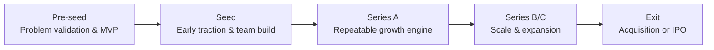
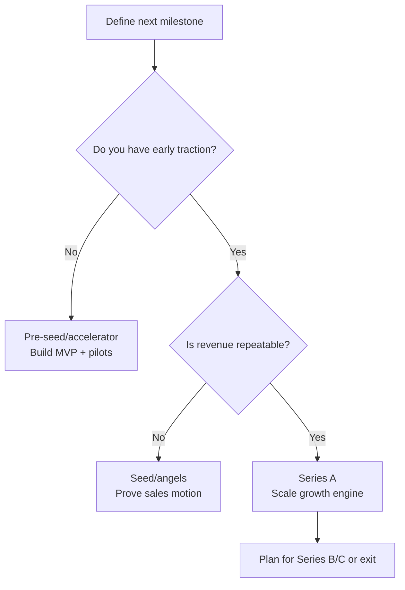

import ModuleNav from "../../snippets/module-nav.jsx";

## Module Navigation

### All modules

- [Module 1: The Entrepreneurial Finance Ecosystem and Funding Landscape](/textbook/modules/module-01)
- [Module 2: Evaluating Venture Opportunities and Business Planning](/textbook/modules/module-02)
- [Module 3: Financial Projections and Startup Financials](/textbook/modules/module-03)
- [Module 4: Startup Valuation Methods and Cap Tables](/textbook/modules/module-04)
- [Module 5: Startup Valuation Methods](/textbook/modules/module-05)
- [Module 6: Term Sheet Mechanics](/textbook/modules/module-06)
- [Module 7: Cap Tables and Dilution](/textbook/modules/module-07)
- [Module 8: Investor–Founder Dynamics](/textbook/modules/module-08)
- [Module 9: Exit Strategies – IPOs, Acquisitions, and Secondaries](/textbook/modules/module-09)
- [Module 10: LP–GP Relationships and Venture Fund Structures](/textbook/modules/module-10)
- [Module 11: Global Venture Capital Markets and Cross-Border Investing](/textbook/modules/module-11)
- [Module 12: The Future of Venture Capital – Emerging Trends and Alternative Models](/textbook/modules/module-12)

### In this module

<TOC />

### Jump to next module

[Module 2: Evaluating Venture Opportunities and Business Planning](/textbook/modules/module-02)

## Module Snapshot

<info>
  Focus on the core venture finance decisions tied to **Module 1**: opportunity selection, risk trade-offs, and investor-style reasoning.
</info>

## Key Facts

<CardGroup>
  <Card title="Module theme" icon="compass">
    Entrepreneurial finance ecosystem and the funding lifecycle from pre-seed through exit.
  </Card>
  <Card title="Key frameworks" icon="sitemap">
    Funding ladder, financing gap logic, and the investor vs. founder lens.
  </Card>
  <Card title="Core deliverable" icon="clipboard-check">
    Funding lifecycle map plus a memo on when to avoid VC.
  </Card>
</CardGroup>

## Learning Objectives

<success>
  - Explain how entrepreneurial finance differs from corporate finance under uncertainty.
  - Map the full funding lifecycle (pre-seed through exit) and match capital sources to stages.
  - Identify the key players in the startup funding ecosystem and their roles beyond capital.
  - Distinguish between bootstrapping, angel financing, venture capital, and non-dilutive funding.
  - Compare U.S. and Canadian entrepreneurial finance ecosystems and the role of government programs.
  - Evaluate the founder trade-offs of pursuing VC versus alternative funding paths.
</success>

## Module Tasks

<tip>
  - Map the funding lifecycle of a venture in your chosen industry (pre-seed → exit) and annotate which capital sources fit each stage.
  - Write a 1-page memo explaining when a founder should avoid VC and why, using at least two criteria from the module.
</tip>

## Key Concepts

- **Entrepreneurial finance:** Financial decision-making for new ventures under extreme uncertainty and high growth potential.
- **Bootstrapping:** Funding a venture primarily with founder resources or early customer revenue.
- **Financing gap:** The capital gap where startups are too risky for banks but need more money than founders can provide.
- **Angel investors:** Affluent individuals investing personal funds and mentorship in early-stage startups.
- **Venture capital (VC):** Pooled equity financing for high-growth startups, typically in exchange for ownership and control rights.
- **Funding lifecycle:** Stages from pre-seed/seed to Series A/B/C and exit (IPO or acquisition).
- **Non-dilutive funding:** Grants or loans that do not require giving up equity (e.g., the Industrial Research Assistance Program (IRAP), Business Development Bank of Canada (BDC) Capital).
- **Friends, family, and fools (FFF):** Informal early capital from personal networks.
- **Minimum viable product (MVP):** The simplest testable version of a product used to validate demand.
- **Simple Agreement for Future Equity (SAFE):** A deferred equity instrument that converts in a later priced round.
- **Software-as-a-service (SaaS):** Subscription software delivered over the internet.
- **Annual recurring revenue (ARR):** Annualized subscription revenue run rate.
- **Monthly recurring revenue (MRR):** Monthly subscription revenue run rate.
- **Strategic investors:** Corporate partners who invest for strategic synergy, not only financial returns.

## Main Content

### Chapter 1: Definitions and ecosystem map

Entrepreneurial finance starts with **who provides capital**, **when they provide it**, and **what they expect in return**.

- **Bootstrapping:** Founder capital and early customer revenue; optimizes control and capital efficiency.
- **Angel capital:** High-touch early equity for product/market validation.
- **Venture capital:** High-growth equity with board influence and exit expectations.
- **Non-dilutive capital:** Grants/loans that preserve ownership but add repayment or compliance risk.

#### Ecosystem Map: Roles and financing paths

The ecosystem is a relay team: each player steps in at different milestones and hands the venture forward.

- **Founders:** Start with personal savings, early revenue, and sweat equity. _Example path:_ A founder bootstraps an MVP to reach 10 pilot customers before raising an angel round.
- **Angels:** Individuals who fund early validation and mentorship. _Example path:_ Angels provide a \$250k seed to hire the first engineer and test pricing.
- **Accelerators:** Cohort programs offering small checks, mentors, and demo day access. _Example path:_ An accelerator invests \$100k for 6% to help a startup refine its pitch and close its seed round.
- **Venture capital (VC):** Professional funds backing scalable growth with governance rights. _Example path:_ A SaaS company with \$50k MRR raises Series A to scale sales and expand to new markets.
- **Strategic investors:** Corporate partners investing for synergies. _Example path:_ A telecom company invests in a fintech startup to secure distribution and product integration.
- **Lenders:** Banks or specialized lenders providing debt when cash flows are predictable. _Example path:_ After hitting \$1M ARR, a startup uses a venture debt line to extend runway between rounds.
- **Government programs:** Grants or loans that reduce dilution and support R&D. _Example path:_ A cleantech startup uses IRAP or BDC support to fund pilots before a priced seed round.

<note>
  Capital sources are a ladder: each rung funds a milestone, not just a budget.
</note>

<CardGroup>
  <Card title="Seed/Pre-seed" icon="seedling">
    Prototype, early users, and founder-market fit. Angels, accelerators, and friends, family, and fools (FFF) are common.
  </Card>
  <Card title="Series A/B" icon="chart-line">
    Repeatable growth, metrics, and scaling. VC is common; governance formalizes.
  </Card>
  <Card title="Non-dilutive" icon="hand-holding-dollar">
    Grants and loans bridge gaps when revenue traction exists but dilution is undesirable.
  </Card>
</CardGroup>

/

### Chapter 2: Frameworks and decision tools

Use the funding lifecycle ladder to connect each stage to the milestone investors expect and the type of capital that fits. It keeps the conversation anchored in outcomes rather than just runway.

<Tabs>
  <Tab title="Funding lifecycle ladder">
    | Stage          | Milestone focus                                    | Typical capital range | Investor expectations                                 |
    | -------------- | -------------------------------------------------- | --------------------- | ----------------------------------------------------- |
    | **Pre-seed**   | Problem validation, MVP, early user feedback       | \$25k–\$500k          | Proof of demand signals; founder-market fit           |
    | **Seed**       | Early traction, team formation, pricing validation | \$500k–\$3M           | Clear ICP, early revenue or pilots, credible GTM      |
    | **Series A**   | Repeatable growth engine                           | \$3M–\$15M            | Strong unit economics, scalable acquisition channels  |
    | **Series B/C** | Scale and expansion                                | \$10M–\$50M+          | Efficient growth, operating cadence, leadership depth |
    | **Exit**       | Liquidity event                                    | N/A                   | Strategic value or public market readiness            |

    **Why the stage matters**

    - **Pre-seed:** The goal is learning speed; capital is small because the business model is still fragile.
    - **Seed:** Investors need proof that demand exists and the team can execute a focused go-to-market.
    - **Series A:** The bar shifts to repeatability; growth must be predictable, not just promising.
    - **Series B/C:** Capital funds scale, so investors expect operational maturity and clear expansion levers.
    - **Exit:** The company must demonstrate defensible value for an acquirer or the public markets.
  </Tab>
  <Tab title="Financing gap logic">
    - Banks require collateral and predictability.
    - Startups lack both, so **equity** fills the gap.
    - Equity investors demand **high growth and governance rights**.
  </Tab>
</Tabs>

**Takeaway:** The ladder helps you match the next milestone to the most realistic capital source instead of defaulting to VC.

### Chapter 3: Investor vs. founder perspective

| Dimension    | Founder lens            | Investor lens             | Implication                 |
| ------------ | ----------------------- | ------------------------- | --------------------------- |
| Goal         | Build a durable company | Maximize portfolio return | Growth vs. control tension  |
| Time horizon | Long-term mission       | 5–10 year exit            | Exit planning starts early  |
| Risk view    | Personal downside       | Portfolio diversification | Different risk appetites    |
| Capital use  | Runway and flexibility  | Milestones and validation | Tranche funding and metrics |

### Chapter 3.5: Mini-cases on VC fit

Use these scenarios to decide whether VC is the right path, then compare with the model answer.

<AccordionGroup>
  <Accordion title="Mini-case A: VC-fit startup — CloudOps AI">
    **Scenario:** CloudOps AI automates cloud cost optimization for enterprise customers. ARR is \$1.5M with 20% MoM growth. Gross margins are 85%, sales cycles are repeatable, and churn is \<2%.

    **Decision prompts:** Should CloudOps pursue Series A VC? What milestone should the round fund?

    **Model answer:** Yes. It shows strong unit economics, rapid growth, and a scalable distribution motion. The Series A should fund a repeatable enterprise sales team, expansion to adjacent verticals, and product depth to protect retention.
  </Accordion>
  <Accordion title="Mini-case B: Non-VC-fit startup — Neighborhood Kitchens">
    **Scenario:** Neighborhood Kitchens operates three profitable meal-prep locations in a single metro area with \$900k annual revenue. Growth depends on opening more locations and hiring kitchen staff.

    **Decision prompts:** Is VC appropriate? What funding sources fit better?

    **Model answer:** Likely not. It is capital-intensive, locally constrained, and does not show VC-scale upside. Better fits include retained earnings, a bank loan, or small angel financing for one additional location.
  </Accordion>
  <Accordion title="Mini-case C: Borderline — BioSense Diagnostics">
    **Scenario:** BioSense has a lab-validated prototype and two pilot hospital partners but faces long regulatory timelines. The market is large, but revenue could be 2–3 years away.

    **Decision prompts:** Should BioSense raise VC now or stage funding? What should it prove first?

    **Model answer:** Borderline. VC could be viable if the team can de-risk regulatory milestones and show clear clinical value. A staged path (grant + angel bridge) to reach regulatory progress and pilot outcomes before a larger VC round is prudent.
  </Accordion>
</AccordionGroup>

### Chapter 4: Worked example with numbers

**Scenario:** A software-as-a-service (SaaS) startup plans a two-step funding path to reach \$1M ARR.

The table below shows the minimum capital and milestone sequencing needed to unlock the next round.

| Stage    | Amount | Instrument | Post-money | Milestone                  |
| -------- | ------ | ---------- | ---------- | -------------------------- |
| Pre-seed | \$300k | SAFE       | \$3.0M     | MVP and 20 pilot customers |
| Seed     | \$1.2M | Equity     | \$6.0M     | \$50k MRR, 4% churn        |

**Takeaway:** Funding path decisions should be milestone-driven—each round should unlock a measurable step toward repeatable growth.

**Cap table snapshot after Seed (simplified)**

| Holder         | Ownership |
| -------------- | --------- |
| Founders       | 70%       |
| Angel/Pre-seed | 10%       |
| Seed investors | 20%       |

### Chapter 5: Summary checklist

<Steps>
  <Step title="Match capital to milestone">
    Define the next value-creating milestone before choosing a funding source.
  </Step>
  <Step title="Model ownership impact">
    Estimate dilution and governance changes for each funding path.
  </Step>
  <Step title="Align incentives">
    Choose investors whose time horizon and growth expectations match yours.
  </Step>
</Steps>

## Key Takeaways

<success>
  - Capital sources are milestone-driven, not interchangeable.
  - The financing gap pushes high-growth startups toward equity and governance trade-offs.
  - VC is a strategic fit decision, not a default choice.
</success>

## Worked Examples

### In-class activity: Funding pathways brainstorm

- **Setup:** Groups of 3–4 receive a one-page scenario of an early-stage startup (software, hardware, biotech, local service, etc.).
- **Materials:** Scenario handouts and whiteboard/flip chart space for funding plans.
- **Step 1 — Identify funding needs:** Estimate capital required for the next milestone (product launch, revenue target), and list expected expenses.
- **Step 2 — Brainstorm sources:** Map possible sources (personal funds/FFF, angels, VC, loans, crowdfunding, grants) that fit the scenario.
- **Step 3 — Choose a funding path:** Decide on a 1–2 year strategy with timing, amount, and rationale (e.g., bootstrap → angel; accelerator → seed VC).
- **Step 4 — Prepare to present:** Summarize the plan, funding amount, and 2–3 reasons it fits the venture.
- **Presentations:** Each group gives a 3-minute pitch; the instructor prompts trade-off thinking.
- **Expected output:** A comparative list of scenarios vs. funding paths to reinforce appropriate capital at the appropriate time.

### Case study: GreenRidge Brewing Co. — A funding dilemma

#### Background and current performance

- Nate Williams and Sarah Li founded GreenRidge Brewing Co. in Ontario in 2021.
- Initial capital: \$150,000 family loan and \$100,000 personal savings.
- 2023 results: CAD \$1.2M revenue and \$100,000 profit; demand is strong and capacity constrained.

#### Expansion opportunity and two paths

- **Slow, organic growth:**