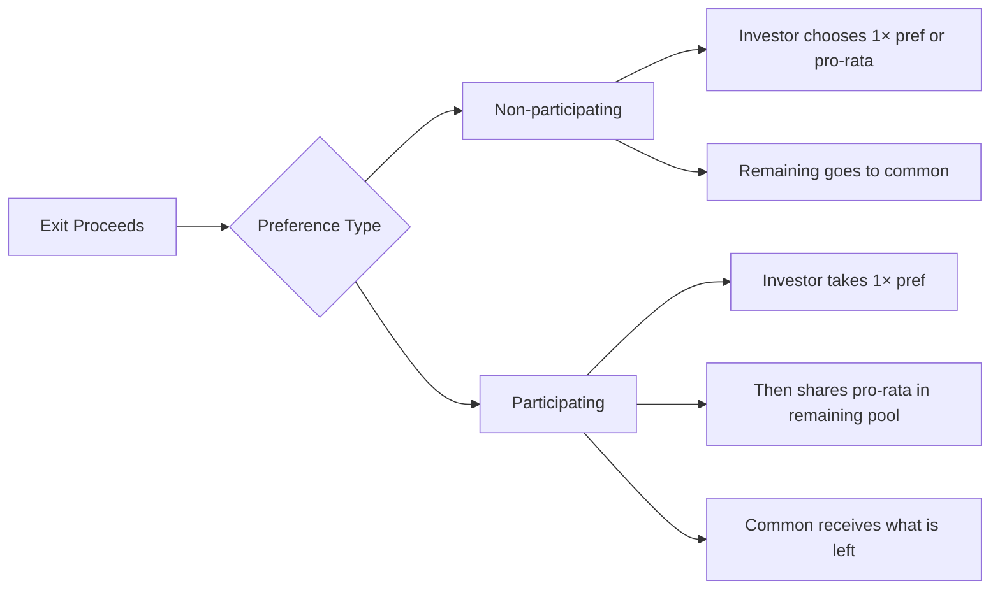

import ModuleNav from "../../snippets/module-nav.mdx";

## Module Navigation

### All modules
- [Module 1: The Entrepreneurial Finance Ecosystem and Funding Landscape](/textbook/modules/module-01)
- [Module 2: Evaluating Venture Opportunities and Business Planning](/textbook/modules/module-02)
- [Module 3: Financial Projections and Startup Financials](/textbook/modules/module-03)
- [Module 4: Startup Valuation Methods and Cap Tables](/textbook/modules/module-04)
- [Module 5: Startup Valuation Methods](/textbook/modules/module-05)
- [Module 6: Term Sheet Mechanics](/textbook/modules/module-06)
- [Module 7: Cap Tables and Dilution](/textbook/modules/module-07)
- [Module 8: Investor–Founder Dynamics](/textbook/modules/module-08)
- [Module 9: Exit Strategies – IPOs, Acquisitions, and Secondaries](/textbook/modules/module-09)
- [Module 10: LP–GP Relationships and Venture Fund Structures](/textbook/modules/module-10)
- [Module 11: Global Venture Capital Markets and Cross-Border Investing](/textbook/modules/module-11)
- [Module 12: The Future of Venture Capital – Emerging Trends and Alternative Models](/textbook/modules/module-12)

### In this module
<TOC />

### Jump to next module
[Module 7: Cap Tables and Dilution](/textbook/modules/module-07)

## Module Snapshot

<Callout type="info" title="This module at a glance">
Focus on the core venture finance decisions tied to **Module 6**: opportunity selection, risk trade-offs, and investor-style reasoning.
</Callout>

## Key Facts

<CardGroup>
  <Card title="Module theme" icon="compass">
    Term sheet mechanics and the trade-offs between economics and control.
  </Card>
  <Card title="Key frameworks" icon="sitemap">
    Liquidation preference, anti-dilution, and governance rights.
  </Card>
  <Card title="Core deliverable" icon="clipboard-check">
    Founder brief on terms plus a negotiation trade-off.
  </Card>
</CardGroup>

## Learning Objectives

<Callout type="success" title="Learning Objectives">
- Distinguish economic vs. control terms in venture capital (VC) term sheets.
- Evaluate liquidation preference structures and their payout impact.
- Compare weighted-average vs. full-ratchet anti-dilution.
- Assess board composition and protective provisions for control.
- Recognize market cycles and how they shift term sheet norms.
</Callout>

## Module Tasks

<Callout type="tip" title="Module Tasks">
- [ ] Summarize key term sheet clauses in a 1-page founder brief (liquidation preference, anti-dilution, control rights).
- [ ] Propose one negotiation trade-off you would accept to preserve founder control.
</Callout>

## Key Concepts

### Economic terms

- **Liquidation preference:** The contractual priority of payouts on exit; 1× non-participating remains the standard baseline. **Consequence:** This term shifts who gets paid first in a sale.
- **Participating preferred:** A structure that combines the preference with pro-rata participation, effectively creating a “double dip.” **Consequence:** This term reduces common stock payouts in mid-range exits.
- **Anti-dilution:** Protection against down rounds that adjusts the investor’s conversion price (weighted-average versus full-ratchet). **Consequence:** This term can increase founder dilution after a down round.
- **Vesting:** Earned ownership over time that preserves incentives for founders and key hires. **Consequence:** This term determines what equity someone keeps if they leave.

### Control terms

- **Protective provisions:** Investor consent rights that allow vetoes on major corporate actions. **Consequence:** This term shifts control in board votes and key approvals.
- **No-shop clause:** An exclusivity period that prevents the company from soliciting alternative offers while diligence proceeds. **Consequence:** This term limits a founder’s leverage in negotiations.
- **Drag-along:** A mechanism allowing majority holders to require minority holders to participate in an approved sale. **Consequence:** This term can force minority holders into an exit.

## Main Content

### Chapter 1: Definitions and term sheet anatomy

Term sheets set the **economic** and **control** rights of a deal. In the discussion that follows, the terms are separated to clarify which clauses determine payouts versus decision authority.

**Economic terms**

- **Valuation:** Pre/post money and ownership. **Consequence:** This term sets how much dilution founders accept today.
- **Liquidation preference:** Payout order on exit. **Consequence:** This term decides who gets paid first.
- **Participation:** Whether investors get preference and pro rata. **Consequence:** This term changes how much common keeps at mid-range exits.

**Control terms**

- **Protective provisions:** Veto rights for major actions. **Consequence:** This term shifts practical control over key decisions.

<Callout type="warning" title="Economics vs. control">
A “high valuation” can still be founder-unfriendly if control terms are strict.
</Callout>

| Term category | What it covers | Why it matters | Typical founder concern | Implication in practice |
| --- | --- | --- | --- | --- |
| **Economic terms** | Valuation, liquidation preference, participation, dividends, option pool | Determine **who gets paid and how much** in an exit | “Will we get rewarded if the company performs?” | A 1× participating pref can reduce common payouts at mid-tier exits even with a strong valuation. |
| **Control terms** | Board seats, protective provisions, consent rights, vetoes | Define **who decides** on major actions | “Can we move fast and keep strategic control?” | A single investor veto can block financings, acquisitions, or founder compensation changes. |
| **Downside protection** | Anti-dilution, pay-to-play, redemption rights | Shift risk when performance lags | “How much control or ownership do we lose in a down round?” | Full-ratchet anti-dilution can reset the investor price, increasing dilution in the next round. |
| **Liquidity timing** | Drag-along, registration rights, redemption triggers | Influence exit path and timing | “Can we be forced into a sale or IPO?” | Drag-along can accelerate an exit even if some founders prefer to stay independent. |

<CardGroup>
  <Card title="Economic terms" icon="wallet">
    Valuation, preference, and participation define payouts.
  </Card>
  <Card title="Control terms" icon="shield">
    Board seats and veto rights shape decision power.
  </Card>
  <Card title="Downside protection" icon="umbrella">
    Terms reallocate risk in weak exits.
  </Card>
</CardGroup>

### Chapter 2: Frameworks and decision tools

The frameworks below mirror the separation between economics and control, emphasizing that pricing terms and governance rights are negotiated independently even when they are discussed in the same meeting.

<Tabs>
  <Tab title="Economic terms">
    - Valuation and investment size
    - Liquidation preference (1× vs. 2×)
    - Participation and dividends
  </Tab>
  <Tab title="Control terms">
    - Board composition
    - Protective provisions
    - Information rights
  </Tab>
</Tabs>

### Chapter 3: Investor vs. founder perspective

| Dimension | Founder lens | Investor lens | Implication |
| --- | --- | --- | --- |
| Liquidation | Maximize common payout | Downside protection | Exit waterfall shifts |
| Board | Maintain agility | Oversight and risk control | Governance trade-offs |
| Participation | Avoid double-dip | Capture upside | Economics can change a lot |
| Option pool | Minimize dilution | Ensure hiring capacity | Pre-money debate |

### Chapter 4: Worked example with numbers

**Scenario:** \$3M investment at \$9M pre, 1× participating preference.

**Lead-in:** Use the table to compare how participating preferred “double dips” in a modest exit versus a non-participating alternative. The figures below isolate the economic effect of participation while holding valuation constant.

| Exit Value | Investor Payout | Common Payout |
| --- | --- | --- |
| \$6M | \$3M (1×) | \$3M |
| \$12M | \$3M + 25% of \$9M = \$5.25M | \$6.75M |
| \$30M | \$3M + 25% of \$27M = \$9.75M | \$20.25M |

**Direct interpretation:** At a \$12M exit, the investor collects \$5.25M instead of choosing between \$3M or \$3M pro-rata. That extra \$2.25M comes straight from common holders. This is why founders care about participating prefs even when the valuation sounds great.

**Takeaway:** Participation shifts more value away from common stock at mid-range exits, even when the headline valuation looks strong. The incentive is clear: investors lock in downside protection and still share upside, while founders carry more of the mid-exit dilution.

### Chapter 5: Liquidation preference waterfall (step-by-step)

**Scenario:** \$6M Series A at \$18M pre (25% ownership), 1× **non-participating** preference.

**Cap table (post-money):**
- Founders: 60%
- Employee option pool: 15%
- Series A investors: 25%

**Waterfall logic:**
1. Investor chooses **greater of** (a) 1× preference or (b) pro-rata common.
2. Everyone else splits the remaining proceeds pro-rata.

The table below walks through the distribution math across different exit values, showing when the investor stays with the preference versus converts to common.

| Exit value | 1× preference amount | Investor pro-rata (25%) | Investor chooses | Common pool (founders + option) | Founder payout (60% of common) | Option pool payout (15% of common) |
| --- | --- | --- | --- | --- | --- | --- |
| \$8M | \$6M | \$2M | \$6M pref | \$2M | \$1.2M | \$0.3M |
| \$20M | \$6M | \$5M | \$6M pref | \$14M | \$8.4M | \$2.1M |
| \$40M | \$6M | \$10M | \$10M pro-rata | \$30M | \$18M | \$4.5M |
| \$100M | \$6M | \$25M | \$25M pro-rata | \$75M | \$45M | \$11.25M |

**Takeaway:** Non-participating preferences mostly matter in **low-to-mid exits**. At high exits, the investor converts and participates like common; the table makes explicit the point at which conversion dominates the preference.

### Chapter 6: How board control evolves across rounds

Board control usually shifts from founder-led to shared governance as new investors join.

**Example cap table across rounds**

| Round | Founders | Seed investors | Series A | Series B | Employee pool | Notes |
| --- | --- | --- | --- | --- | --- | --- |
| Seed close | 70% | 20% | — | — | 10% | Founder control and early investor influence |
| Series A | 55% | 15% | 20% | — | 10% | Investor adds governance leverage |
| Series B | 45% | 10% | 18% | 20% | 7% | Control becomes shared with independents |

**Example board seat evolution**

| Stage | Board seats | Typical composition | Control implication |
| --- | --- | --- | --- |
| Seed (3 seats) | 3 | 2 founders, 1 seed investor | Founders retain majority control. |
| Series A (5 seats) | 5 | 2 founders, 2 investors, 1 independent | Balanced control; independent often becomes swing vote. |
| Series B (7 seats) | 7 | 2 founders, 3 investors, 2 independents | Investors can control if independents align with them. |

**Key lesson:** Board control is less about ownership percentage and more about **seat math** and who can assemble a voting majority.

### Chapter 7: Term trade-off lab

Pick the package you would accept **and justify why**, referencing economics vs. control trade-offs.

| Package | Valuation | Liquidation preference | Board seats | Anti-dilution | Other terms |
| --- | --- | --- | --- | --- | --- |
| **A: High valuation, heavy control** | \$30M pre | 1× participating | 2 founders / 2 investors / 1 independent (independent chosen by investors) | Full ratchet | 18% pre-money option pool |
| **B: Balanced economics and control** | \$24M pre | 1× non-participating | 2 founders / 2 investors / 1 independent (mutual) | Broad-based weighted average | 12% pre-money option pool |
| **C: Lower valuation, clean terms** | \$20M pre | 1× non-participating with 2× cap on participation | 2 founders / 1 investor / 2 independents (mutual) | Narrow-based weighted average | 10% pre-money option pool |

**Prompt:** Choose one package, explain the trade-offs, and propose **one change** that would make the chosen package acceptable.

<Callout type="info" title="Mini-exercise: Negotiate a trade-off">
Pick one concession you would accept to improve liquidation terms, then explain why.

- [ ] Lower valuation by 5–10% in exchange for 1× non-participating pref.
- [ ] Grant a board observer seat instead of a voting seat.
- [ ] Expand investor information rights but cap participation at 1×.
- [ ] Accept a smaller option pool if the no-shop window is shortened.
</Callout>

### Chapter 8: Summary checklist

<Steps>
  <Step title="Separate economics from control">
    Evaluate valuation and liquidation preferences independently from board terms.
  </Step>
  <Step title="Model the waterfall">
    Test payouts at low, mid, and high exit values.
  </Step>
  <Step title="Negotiate the package">
    Trade valuation for cleaner control and liquidation terms when needed.
  </Step>
</Steps>

## Key Takeaways

<Callout type="success" title="Key Takeaways">
- Term sheets bundle economic and control rights—evaluate both.
- Preference structures reshape exit payouts more than valuation alone.
- Market cycles shift which clauses are negotiable.
</Callout>

## Worked Examples

### In-class activity: “The Term Sheet Tug-of-War”

- **Scenario:** DataSecure Inc. Series A term sheet with aggressive terms.
- **Negotiables:** 1× participating pref, full ratchet, investor-heavy board, 20% pre-money pool.
- **Process:** Founder team and VC team strategize, then negotiate live with instructor moderation.
- **Possible compromise:** 1× non-participating pref, weighted-average anti-dilution, 5-seat balanced board.
- **Lesson:** Term sheets are connected systems; trade-offs protect upside and control.

### Case study: NewBoard Corp term sheet

- **Deal:** \$40M pre, \$8M raise (16.7% ownership), but control-heavy terms.
- **Concerns:** 1× participating pref, investor-leaning board, strong protective provisions.
- **Founder re-vesting:** 50% over 3 years with a 1-year cliff.
- **Analysis:** High valuation can mask control loss; evaluate terms in moderate exits.

### Discussion prompts and teaching notes

- **How would a 1× participating pref affect payouts at \$50M vs. \$200M exits?**
  - Teaching note: Participation hurts most in moderate exits.
- **Does board structure give the VC control?**
  - Teaching note: Investor influence over independents can shift control.
- **Which terms should founders push back on first?**
  - Teaching note: Prefer to cap participation and avoid full ratchet.
- **Would you accept NewBoard’s deal if the VC won’t budge?**
  - Teaching note: Weigh capital need vs. long-term control and upside.

## Pitfalls

<Callout type="warning" title="Pitfalls to Avoid">
- Over-focusing on valuation while ignoring liquidation preference and control.
- Accepting full ratchet anti-dilution without understanding dilution impacts.
- Allowing investor-leaning board structures without checks.
- Treating no-shop clauses as harmless when they limit leverage.
</Callout>

## Quick Checks

<Tabs>
  <Tab title="Founder lens">
    Highlight the two clauses you would negotiate hardest on (e.g., liquidation pref, board control).
  </Tab>
  <Tab title="Investor lens">
    Identify the two clauses you view as non-negotiable to protect downside.
  </Tab>
</Tabs>

<AccordionGroup>
  <Accordion title="Preference math">
    **Question:** What’s the difference between 1× non-participating and 1× participating preferred?  
    **Answer:** Non-participating chooses pref or common; participating gets both.
  </Accordion>
  <Accordion title="Anti-dilution quick check">
    **Question:** Which is harsher: full ratchet or weighted average?  
    **Answer:** Full ratchet.
  </Accordion>
  <Accordion title="Control rights">
    **Question:** Name one protective provision that can block founder actions.  
    **Answer:** Issuing new shares or selling the company without investor consent.
  </Accordion>
</AccordionGroup>

<AccordionGroup>
  <Accordion title="What is a term sheet and is it binding?">
    Mostly non-binding except clauses like no-shop.
  </Accordion>
  <Accordion title="Why include liquidation preferences?">
    Downside protection for investors.
  </Accordion>
  <Accordion title="What is participating preferred?">
    Preference plus pro-rata participation (double dip).
  </Accordion>
  <Accordion title="How does anti-dilution work?">
    Weighted average is mild; full ratchet is harsh.
  </Accordion>
  <Accordion title="What control rights do investors gain?">
    Board seats, vetoes, information and pro rata rights.
  </Accordion>
  <Accordion title="How do market cycles affect terms?">
    Downturns increase investor-friendly clauses.
  </Accordion>
</AccordionGroup>

## Readings

### Required Readings

- **Darden (2015). Early-Stage Term Sheets.** Clause-by-clause explanations with examples.
- **Silicon Valley Bank (SVB) Startup Insights (2021).** Founder-focused checklist of common terms.
- **Feld & Mendelson (2019). Venture Deals (Terms chapter).** Rationale, anecdotes, and sample language.

### Optional Readings

- **Phoenix Strategy Group (2023).** Investor-friendly vs. founder-friendly term comparisons.
- **Wilson Sonsini (2021).** Negotiation tips prioritizing big terms (valuation, prefs, board).

## Summary

- Economic terms drive payout; control terms drive governance.
- Founder-friendly defaults: 1× non-participating prefs, weighted-average anti-dilution, balanced boards.
- Negotiation leverage shifts with market cycles and company traction.

## Practice Questions

**Question:** What does a 1× liquidation preference mean?  

Show answer

**Answer:** Investors get their original investment back before common shareholders.

**Question:** Why is participation sometimes called a “double dip”?  

Show answer

**Answer:** Investors receive preference and then share in remaining proceeds.

**Question:** Why does board composition matter to founders?  

Show answer

**Answer:** It affects strategic control and future financing decisions.

**Question:** Give one action typically requiring investor approval.  

Show answer

**Answer:** Issuing new shares or selling the company.

**Question:** If an investor has 25% ownership and a 1× preference on \$2M, what happens at a \$2M exit?  

Show answer

**Answer:** Investor takes \$2M; common gets \$0.

**Question:** Which matters more: a slightly higher valuation or clean liquidation terms?  

Show answer

**Answer:** Clean terms often matter more over the long run.

**Question:** In a 1× non-participating preference, when does the investor convert to common?  

Show answer

**Answer:** When the pro-rata common payout exceeds the 1× preference amount.

**Question:** Why can a founder still lose control with a majority ownership stake?  

Show answer

**Answer:** Board seat math and protective provisions can shift control even if founders own more shares.

**Question:** How does a full ratchet anti-dilution clause affect founders in a down round?  

Show answer

**Answer:** It resets the investor price to the down-round price, increasing founder dilution.

**Question:** What is one reason investors ask for a larger option pool pre-money?  

Show answer

**Answer:** It ensures the company can hire talent without the investors funding the dilution themselves.

**Question:** In the example waterfall, why does the investor choose the preference at a \$20M exit?  

Show answer

**Answer:** The \$6M preference is larger than the \$5M pro-rata common payout.

**Question:** Which board composition is most likely to preserve founder influence: 2F/2I/1Ind (investor-chosen) or 2F/1I/2Ind (mutual)?  

Show answer

**Answer:** 2F/1I/2Ind (mutual), because founders are less likely to be outvoted by investor-aligned independents.

## Mini-Cases

<AccordionGroup>
  <Accordion title="Mini-case 1: The mid-exit squeeze">
    **Scenario:** NimbusAI raises \$8M at a \$32M pre with a 1× participating preference and a 20% option pool. The company exits for \$45M.  
    **Prompt:** Explain why founders feel squeezed despite a headline 4× return on the investment.  
    **Answer (spoiler):** The participating preference returns the \$8M first, then investors take their pro-rata share of the remaining \$37M. This meaningfully reduces the common pool at a mid-range exit and can make a “good” exit feel disappointing to founders.
  </Accordion>
  <Accordion title="Mini-case 2: Board control drift">
    **Scenario:** ApexHealth has a 5-seat board: 2 founders, 2 investors, and 1 independent chosen by investors. Founders still own 55%.  
    **Prompt:** How could founders lose control of a major strategic decision?  
    **Answer (spoiler):** The investor-chosen independent can align with the investors, creating a 3–2 voting bloc that can override founder preferences even with majority ownership.
  </Accordion>
  <Accordion title="Mini-case 3: Term trade-off decision">
    **Scenario:** You must choose between a higher valuation with full ratchet anti-dilution or a lower valuation with weighted-average anti-dilution.  
    **Prompt:** Which package better protects founders in a down round, and why?  
    **Answer (spoiler):** The lower valuation with weighted-average anti-dilution is generally safer for founders because it avoids the severe dilution impact of a full ratchet.
  </Accordion>
</AccordionGroup>

<ModuleNav previous="/textbook/modules/module-05" previousLabel="Module 5: Startup Valuation Methods" next="/textbook/modules/module-07" nextLabel="Module 7: Cap Tables and Dilution" />
