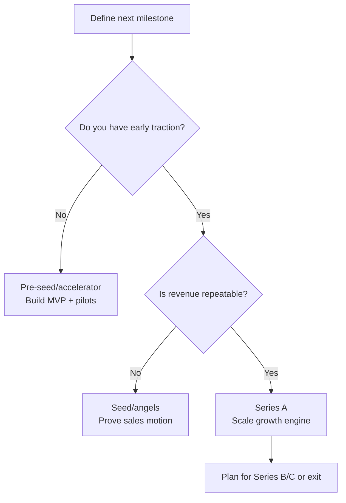

import ModuleNav from "/snippets/module-nav.mdx";

## Module Navigation

### All modules
- [Module 1: The Entrepreneurial Finance Ecosystem and Funding Landscape](/textbook/modules/module-01)
- [Module 2: Evaluating Venture Opportunities and Business Planning](/textbook/modules/module-02)
- [Module 3: Financial Projections and Startup Financials](/textbook/modules/module-03)
- [Module 4: Startup Valuation Methods and Cap Tables](/textbook/modules/module-04)
- [Module 5: Startup Valuation Methods](/textbook/modules/module-05)
- [Module 6: Term Sheet Mechanics](/textbook/modules/module-06)
- [Module 7: Cap Tables and Dilution](/textbook/modules/module-07)
- [Module 8: Investor–Founder Dynamics](/textbook/modules/module-08)
- [Module 9: Exit Strategies – IPOs, Acquisitions, and Secondaries](/textbook/modules/module-09)
- [Module 10: LP–GP Relationships and Venture Fund Structures](/textbook/modules/module-10)
- [Module 11: Global Venture Capital Markets and Cross-Border Investing](/textbook/modules/module-11)
- [Module 12: The Future of Venture Capital – Emerging Trends and Alternative Models](/textbook/modules/module-12)

### In this module
<TOC />

### Jump to next module
[Module 2: Evaluating Venture Opportunities and Business Planning](/textbook/modules/module-02)

## Module Snapshot

<Callout type="info" title="This module at a glance">
This module frames the core venture finance choices in **Module 1**, emphasizing opportunity selection, risk trade-offs, and investor-style reasoning founders actually face. Reality check: most financing paths are constrained by market size, timing, and access—not just ambition.
</Callout>

## Key Facts

<CardGroup>
  <Card title="Module theme" icon="compass">
    The entrepreneurial finance ecosystem and the funding lifecycle from pre-seed through exit.
  </Card>
  <Card title="Key frameworks" icon="sitemap">
    Funding ladder, financing gap logic, and the investor vs. founder lens.
  </Card>
  <Card title="Core deliverable" icon="clipboard-check">
    A funding lifecycle map plus a memo explaining when to avoid VC.
  </Card>
</CardGroup>

## Learning Objectives

<Callout type="success" title="Learning Objectives">
- Explain how entrepreneurial finance differs from corporate finance under uncertainty.
- Map the funding lifecycle (pre-seed through exit) and match capital sources to stages.
- Identify key players in the startup funding ecosystem and their roles beyond capital.
- Distinguish between bootstrapping, angel financing, venture capital, and non-dilutive funding.
- Compare U.S. and Canadian entrepreneurial finance ecosystems and the role of government programs.
- Evaluate founder trade-offs in pursuing VC versus alternative funding paths.
</Callout>

## Module Tasks

<Callout type="tip" title="Module Tasks">
- [ ] Map the funding lifecycle of a venture in your chosen industry (pre-seed → exit) and annotate which capital sources fit each stage.
- [ ] Write a 1-page memo explaining when a founder should avoid VC and why, using at least two criteria from the module.
</Callout>

## Key Concepts

- **Entrepreneurial finance:** Financial decision-making for new ventures under extreme uncertainty and high growth potential.
- **Bootstrapping:** Funding a venture primarily with founder resources or early customer revenue.
- **Financing gap:** The capital gap where startups are too risky for banks but need more money than founders can provide.
- **Angel investors:** Affluent individuals investing personal funds and mentorship in early-stage startups.
- **Venture capital (VC):** Pooled equity financing for high-growth startups in exchange for ownership and control rights, typically tied to staged milestones and exit expectations.
- **Funding lifecycle:** A staged path from pre-seed/seed to Series A/B/C and exit (IPO or acquisition), where each round is tied to a specific risk-reduction milestone.
- **Non-dilutive funding:** Grants or loans that do not require giving up equity (e.g., the Industrial Research Assistance Program (IRAP), Business Development Bank of Canada (BDC) Capital).
- **Friends, family, and fools (FFF):** Informal early capital from personal networks.
- **Minimum viable product (MVP):** The simplest testable version of a product used to validate demand.
- **Simple Agreement for Future Equity (SAFE):** A deferred equity instrument that converts in a later priced round.
- **Software-as-a-service (SaaS):** Subscription software delivered over the internet.
- **Annual recurring revenue (ARR):** Annualized subscription revenue run rate.
- **Monthly recurring revenue (MRR):** Monthly subscription revenue run rate.
- **Strategic investors:** Corporate partners who invest for strategic synergy, not only financial returns.

## Main Content

### Chapter 1: Definitions and ecosystem map

Entrepreneurial finance starts by clarifying who supplies capital, when it arrives, and what each provider expects in return. This framing anchors the ecosystem map and keeps decisions grounded in realistic trade-offs. Reality check: most startups are constrained by milestone timing, not by a lack of investor options.

**Definition list**
- **Bootstrapping:** Founder capital and early customer revenue, optimized for control and capital efficiency.
- **Angel capital:** High-touch early equity that supports product/market validation and mentoring.
- **Venture capital:** High-growth equity paired with governance rights and a time-bound exit expectation.
- **Non-dilutive capital:** Grants or loans that preserve ownership but introduce repayment or compliance obligations.

These definitions clarify the roles each source plays before we map how the ecosystem hands a venture from milestone to milestone. Reality check: each handoff comes with new expectations, reporting, and loss of flexibility.

#### Ecosystem Map: Roles and financing paths

The ecosystem functions like a relay: each participant enters at a distinct milestone and advances the venture to the next stage. Reality check: if you miss a milestone, the next capital source usually walks.

- **Founders:** Start with personal savings, early revenue, and sweat equity. *Example path:* A founder bootstraps an MVP to reach 10 pilot customers before raising an angel round.
- **Angels:** Individuals who fund early validation and mentorship. *Example path:* Angels provide a \$250k seed to hire the first engineer and test pricing.
- **Accelerators:** Cohort programs offering small checks, mentors, and demo day access. *Example path:* An accelerator invests \$100k for 6% to help a startup refine its pitch and close its seed round.
- **Venture capital (VC):** Professional funds backing scalable growth with governance rights. *Example path:* A SaaS company with \$50k MRR raises Series A to scale sales and expand to new markets.
- **Strategic investors:** Corporate partners investing for synergies. *Example path:* A telecom company invests in a fintech startup to secure distribution and product integration.
- **Lenders:** Banks or specialized lenders providing debt when cash flows are predictable. *Example path:* After hitting \$1M ARR, a startup uses a venture debt line to extend runway between rounds.
- **Government programs:** Grants or loans that reduce dilution and support R&D. *Example path:* A cleantech startup uses IRAP or BDC support to fund pilots before a priced seed round.

<Callout type="note" title="Ecosystem in one sentence">
Capital sources form a ladder: each rung finances a milestone rather than simply extending runway. Reality check: runway without a milestone plan just delays the same fundraising problem.
</Callout>

<CardGroup>
  <Card title="Seed/Pre-seed" icon="seedling">
    Prototype, early users, and founder-market fit. Angels, accelerators, and friends, family, and fools (FFF) are common.
  </Card>
  <Card title="Series A/B" icon="chart-line">
    Repeatable growth, metrics, and scaling. VC is common; governance formalizes.
  </Card>
  <Card title="Non-dilutive" icon="hand-holding-dollar">
    Grants and loans bridge gaps when revenue traction exists but dilution is undesirable.
  </Card>
</CardGroup>

To connect these roles to decisions, the next chapter introduces the funding ladder and the logic that links milestones to capital type.

### Chapter 2: Frameworks and decision tools

A disciplined funding process ties each round to a concrete milestone, not just a cash need. The funding lifecycle ladder and financing gap logic translate strategy into staged, investor-ready plans. Reality check: investors fund de-risking, not narratives.

**Definition list**
- **Funding lifecycle ladder:** A stage-by-stage roadmap that links milestones to the most realistic capital sources.
- **Milestone:** A measurable proof point (e.g., MVP validation, repeatable revenue) that reduces risk for the next investor.
- **Financing gap:** The stretch where startups are too risky for debt but require more capital than founders can provide.

The tools below operationalize these definitions by specifying what each stage must prove. Reality check: if you cannot state the next proof point in one sentence, you are not ready for that round.

<Tabs>
  <Tab title="Funding lifecycle ladder">
    | Stage | Milestone focus | Typical capital range | Investor expectations |
    | --- | --- | --- | --- |
    | **Pre-seed** | Problem validation, MVP, early user feedback | \$25k–\$500k | Proof of demand signals; founder-market fit |
    | **Seed** | Early traction, team formation, pricing validation | \$500k–\$3M | Clear ICP, early revenue or pilots, credible GTM |
    | **Series A** | Repeatable growth engine | \$3M–\$15M | Strong unit economics, scalable acquisition channels |
    | **Series B/C** | Scale and expansion | \$10M–\$50M+ | Efficient growth, operating cadence, leadership depth |
    | **Exit** | Liquidity event | N/A | Strategic value or public market readiness |

    **Why the stage matters**

    - **Pre-seed:** The goal is learning velocity; capital stays small because the model is still fragile. Reality check: most pre-seed rounds are small enough to fund a few hires and 6–12 months of experiments.
    - **Seed:** Investors need evidence of demand and a team capable of executing a focused go-to-market. Reality check: “interest” is not demand—paying users or signed pilots matter.
    - **Series A:** The bar shifts to repeatability; growth must be predictable, not only promising. Reality check: a single customer or channel can’t carry the round.
    - **Series B/C:** Capital funds scale, so investors expect operational maturity and clear expansion levers. Reality check: hiring faster without repeatable economics just increases burn.
    - **Exit:** The company must demonstrate defensible value for an acquirer or the public markets. Reality check: exits are rare and often smaller than founders expect.
  </Tab>
  <Tab title="Financing gap logic">
    - Banks require collateral and predictability.
    - Startups typically have neither, so **equity** fills the gap.
    - Equity investors expect **high growth and governance rights** in return for risk.
  </Tab>
</Tabs>

**Takeaway:** The ladder clarifies which milestone unlocks which source of capital, helping founders avoid defaulting to VC too early. Reality check: VC is a fit decision, not a badge of success.

With the lifecycle established, the next section contrasts how founders and investors interpret the same milestones.

### Chapter 3: Investor vs. founder perspective

Founders and investors often use the same data but interpret it through different objectives and time horizons. This comparison clarifies where misalignment typically arises. Reality check: if timelines conflict, the partnership will feel adversarial.

**Definition list**
- **Founder lens:** A long-term view prioritizing mission, control, and resilience.
- **Investor lens:** A portfolio-based view prioritizing return potential and exit timing.
- **Governance rights:** Contractual controls (e.g., board seats, vetoes) that accompany equity investment.

The table below summarizes the implications of these perspectives.

| Dimension | Founder lens | Investor lens | Implication |
| --- | --- | --- | --- |
| Goal | Build a durable company | Maximize portfolio return | Growth vs. control tension |
| Time horizon | Long-term mission | 5–10 year exit | Exit planning starts early |
| Risk view | Personal downside | Portfolio diversification | Different risk appetites |
| Capital use | Runway and flexibility | Milestones and validation | Tranche funding and metrics |

Understanding these lens differences prepares us to test VC fit through concrete scenarios.

### Chapter 3.5: Mini-cases on VC fit

The following scenarios illustrate how VC fit depends on growth economics, scalability, and exit timelines. Use them to practice diagnosing fit before comparing your reasoning to the model answers. Reality check: most businesses are healthy but still non-VC-fit.

**Definition list**
- **VC-fit startup:** A venture with scalable growth, strong unit economics, and credible exit potential.
- **Non-VC-fit startup:** A venture with constrained scale, linear growth, or limited exit upside.
- **Borderline case:** A venture that could be VC-fit if key risks (often regulatory or technical) are resolved.

These cases emphasize that VC is a strategic choice, not a default option. Reality check: if your market can’t support a \$100M+ exit, VC math won’t work.

<AccordionGroup>
  <Accordion title="Mini-case A: VC-fit startup — CloudOps AI">
    **Scenario:** CloudOps AI automates cloud cost optimization for enterprise customers. ARR is \$1.5M with 20% MoM growth. Gross margins are 85%, sales cycles are repeatable, and churn is <2%.

    **Decision prompts:** Should CloudOps pursue Series A VC? What milestone should the round fund?

    **Model answer:** Yes. It shows strong unit economics, rapid growth, and a scalable distribution motion. The Series A should fund a repeatable enterprise sales team, expansion to adjacent verticals, and product depth to protect retention. Reality check: growth needs to be repeatable, not one-time enterprise wins.
  </Accordion>
  <Accordion title="Mini-case B: Non-VC-fit startup — Neighborhood Kitchens">
    **Scenario:** Neighborhood Kitchens operates three profitable meal-prep locations in a single metro area with \$900k annual revenue. Growth depends on opening more locations and hiring kitchen staff.

    **Decision prompts:** Is VC appropriate? What funding sources fit better?

    **Model answer:** Likely not. It is capital-intensive, locally constrained, and does not show VC-scale upside. Better fits include retained earnings, a bank loan, or small angel financing for one additional location. Reality check: linear expansion rarely supports VC returns.
  </Accordion>
  <Accordion title="Mini-case C: Borderline — BioSense Diagnostics">
    **Scenario:** BioSense has a lab-validated prototype and two pilot hospital partners but faces long regulatory timelines. The market is large, but revenue could be 2–3 years away.

    **Decision prompts:** Should BioSense raise VC now or stage funding? What should it prove first?

    **Model answer:** Borderline. VC could be viable if the team can de-risk regulatory milestones and show clear clinical value. A staged path (grant + angel bridge) to reach regulatory progress and pilot outcomes before a larger VC round is prudent. Reality check: regulatory timelines can outlast typical VC fund patience.
  </Accordion>
</AccordionGroup>

Next, we apply milestone-based logic to a concrete funding plan with numbers.

### Chapter 4: Worked example with numbers

This worked example demonstrates how milestones translate into capital needs, instruments, and expected valuation changes. It ties the funding lifecycle to a concrete path from early validation to meaningful revenue. Reality check: valuation only improves when risk actually drops.

**Definition list**
- **Post-money valuation:** The company’s valuation immediately after new capital is invested.
- **SAFE:** A deferred equity instrument that converts at a later priced round.
- **Milestone sequencing:** Ordering proof points so each round unlocks the next source of capital.

These definitions help interpret the funding plan below.

**Scenario:** A software-as-a-service (SaaS) startup plans a two-step funding path to reach \$1M ARR.

The table below shows the minimum capital and milestone sequencing needed to unlock the next round.

| Stage | Amount | Instrument | Post-money | Milestone |
| --- | --- | --- | --- | --- |
| Pre-seed | \$300k | SAFE | \$3.0M | MVP and 20 pilot customers |
| Seed | \$1.2M | Equity | \$6.0M | \$50k MRR, 4% churn |

**Takeaway:** Funding path decisions should be milestone-driven—each round should unlock a measurable step toward repeatable growth. Reality check: if the milestone is vague, the round will be overpriced or uncloseable.

**Cap table snapshot after Seed (simplified)**

| Holder | Ownership |
| --- | --- |
| Founders | 70% |
| Angel/Pre-seed | 10% |
| Seed investors | 20% |

The final chapter consolidates these ideas into a concise decision checklist.

### Chapter 5: Summary checklist

This checklist synthesizes the module’s logic into repeatable decisions founders can use before selecting a financing path. Reality check: “raise because others did” is not a strategy.

**Definition list**
- **Milestone:** The next measurable value-creation target that justifies a funding round.
- **Dilution:** The percentage ownership founders give up when issuing new equity.
- **Incentive alignment:** The degree to which investor timelines and founder goals match.

Use the steps below to structure a disciplined funding plan.

<Steps>
  <Step title="Match capital to milestone">
    Define the next value-creating milestone before choosing a funding source. Reality check: the milestone should be provable within your next 6–12 months.
  </Step>
  <Step title="Model ownership impact">
    Estimate dilution and governance changes for each funding path. Reality check: “just 20% now” compounds across later rounds.
  </Step>
  <Step title="Align incentives">
    Choose investors whose time horizon and growth expectations match yours. Reality check: misaligned incentives show up first when growth slows.
  </Step>
</Steps>

With the checklist complete, the remaining sections reinforce key takeaways and applied exercises.

## Key Takeaways

<Callout type="success" title="Key Takeaways">
- Capital sources are milestone-driven, not interchangeable.
- The financing gap pushes high-growth startups toward equity and governance trade-offs.
- VC is a strategic fit decision, not a default choice. Reality check: most strong businesses still won’t match VC return math.
</Callout>

## Worked Examples

### In-class activity: Funding pathways brainstorm

- **Setup:** Groups of 3–4 receive a one-page scenario of an early-stage startup (software, hardware, biotech, local service, etc.).
- **Materials:** Scenario handouts and whiteboard/flip chart space for funding plans.
- **Step 1 — Identify funding needs:** Estimate capital required for the next milestone (product launch, revenue target), and list expected expenses.
- **Step 2 — Brainstorm sources:** Map possible sources (personal funds/FFF, angels, VC, loans, crowdfunding, grants) that fit the scenario.
- **Step 3 — Choose a funding path:** Decide on a 1–2 year strategy with timing, amount, and rationale (e.g., bootstrap → angel; accelerator → seed VC).
- **Step 4 — Prepare to present:** Summarize the plan, funding amount, and 2–3 reasons it fits the venture.
- **Presentations:** Each group gives a 3-minute pitch; the instructor prompts trade-off thinking.
- **Expected output:** A comparative list of scenarios vs. funding paths to reinforce appropriate capital at the appropriate time.

### Case study: GreenRidge Brewing Co. — A funding dilemma

#### Background and current performance

- Nate Williams and Sarah Li founded GreenRidge Brewing Co. in Ontario in 2021.
- Initial capital: \$150,000 family loan and \$100,000 personal savings.
- 2023 results: CAD \$1.2M revenue and \$100,000 profit; demand is strong and capacity constrained.

#### Expansion opportunity and two paths

- **Slow, organic growth:** Reinvest profits and possibly take a small bank loan to expand capacity over two years.
- **Rapid expansion with outside investment:** Raise ~\$2M, scale capacity quickly, open two locations, and launch a canning line.

#### Venture capital fit considerations

- VC investors seek \$50–100M exits within 5–7 years and expect large upside. Reality check: most regional consumer businesses cannot hit those exit sizes.
- Craft brewing is capital-intensive and regionally constrained, which can limit VC-scale returns.
- Example acquisitions show potential upside, but scaling remains uncertain and competitive.

#### Financial projections and valuation trade-offs

- **Organic plan:** ~CAD \$4M revenue in five years and ~\$0.8M profit.
- **VC-funded plan:** ~\$10M revenue and ~\$2M profit in five years with accelerated growth assumptions.
- Hypothetical VC term: \$2M on \$6M pre-money (25% ownership); founders dilute further in future rounds.
- VC return math implies the company must reach ~\$80–160M exit value for VC targets.
  Reality check: if a credible buyer at that price is unlikely, VC pressure will distort decisions.

#### Alternatives to VC

- **Angel investment:** ~\$500k for a minority stake to fund a single taproom or capacity upgrades.
- **Government-backed loan:** ~\$250k–\$500k for non-dilutive funding, with repayment risk.
- **Combined path:** Angel and loan (~\$750k) to expand moderately without VC pressure.

#### Decision tension

- Sarah favors rapid scale to win market share; Nate prioritizes community ethos and control.
- The case closes with the founders weighing growth vs. control and deciding what funding aligns with their goals.

#### Exhibit 1: Historical financial summary (CAD)

- **2022:** Revenue \$800,000; Net profit \$50,000.
- **2023:** Revenue \$1,200,000; Net profit \$100,000.
- Founders invested ~\$250,000 total; family loan remains outstanding with timely repayments.

#### Exhibit 2: Expansion plan scenarios (5-year outlook)

- **Scenario A — Organic growth:** One new taproom by Year 3, modest capacity increase, ~\$4M revenue, ~\$0.8M profit, founders retain ~100% ownership, potential valuation ~\$8–10M.
- **Scenario B — VC-funded expansion:** \$2M VC in Year 1, two new taprooms by Year 2, canned product line by Year 3, ~\$10M revenue, ~\$2M profit, founders ~70% ownership post-Series A, potential valuation ~\$30–50M.

### Discussion prompts and teaching notes

- **Does GreenRidge Brewing have VC-scale characteristics? Why or why not?**
  - Teaching note: VC targets rapid, scalable growth and large exits. GreenRidge’s physical capacity limits and regional market make VC-scale outcomes unlikely, though brand strength could support a moderate acquisition.
- **What alternative funding options could GreenRidge consider, and what are the trade-offs?**
  - Teaching note: Options include angel investment (smaller dilution, modest growth), bank/BDC loans (non-dilutive but repayment risk), crowdfunding/community investment (marketing upside but complex cap table), and organic reinvestment (slow but control-preserving).
- **If Maple Leaf invests \$2M at a \$10M post-money valuation (20% ownership), what exit size meets VC targets?**
  - Teaching note: 10x return implies \$20M to the VC; at 20% ownership this requires ~\$100M exit value (5x implies ~\$50M exit).
- **How would VC investment change GreenRidge’s operations and decision-making?**
  - Teaching note: Expect aggressive growth targets, board oversight, formal reporting, and exit alignment; potential culture shift and reduced founder autonomy.
- **If you were Priya, would you recommend investing? Why or why not?**
  - Teaching note: Most arguments emphasize limited upside for VC return requirements; a nuanced “no” with a suggestion of smaller investment or alternative financing is reasonable.
- **What funding advice would you give Nate and Sarah?**
  - Teaching note: A blended approach (angel and loan) supports moderate growth while preserving control; founders should align financing with their desired pace and mission.

## Pitfalls

<Callout type="warning" title="Pitfalls to Avoid">
- Assuming VC is common or necessary for most startups when it is statistically rare.
- Ignoring the financing gap and attempting to use bank debt without collateral or predictable cash flows.
</Callout>
- Treating funding sources as interchangeable rather than matching them to venture stage and goals.
- Underestimating dilution and governance implications that come with equity financing.
- Pursuing rapid growth capital when the business model or market size does not support VC-scale returns.

## Decision Checklist: Is VC fit right now?

Use this checklist to evaluate VC fit before committing to the constraints that come with equity capital. Reality check: saying “no” to VC is often the rational choice.

- **Market size:** Can the venture plausibly support \$100M+ revenue or a very large exit? Reality check: if your market tops out at \$20M, the math breaks.
- **Growth rate:** Can you sustain high growth (e.g., 3–5x year-over-year) with a clear acquisition motion? Reality check: growth that depends on paid acquisition without improving payback will stall.
- **Capital intensity:** Do you truly need large upfront capital to unlock growth, or can you stage it? Reality check: staged capital preserves options when plans shift.
- **Exit potential:** Is there a realistic path to acquisition or IPO within 5–10 years? Reality check: “maybe later” is not a plan.

## Common Misconceptions

- **“VC means guaranteed success.”** It signals higher expectations and governance; execution risk remains. Reality check: the capital raises the bar, not the odds.
- **“All growth businesses should raise VC.”** Many durable businesses are too niche or capital-efficient for VC. Reality check: a strong business can be a bad VC deal.
- **“More capital always reduces risk.”** Overfunding can distort priorities and increase burn. Reality check: money without discipline accelerates mistakes.
- **“Debt is always cheaper.”** Debt requires repayment and can be dangerous without predictable cash flow. Reality check: debt can kill a company faster than dilution.

## Applied Exercise: Design a funding path

**Prompt:** Design a 12–24 month funding path with **three milestones** and **capital sources**.

1. **Milestone 1:** Define the validation milestone (e.g., MVP + 20 pilot users).  
   **Source:** Founders, FFF, or accelerator.
2. **Milestone 2:** Define early traction (e.g., \$20k MRR or 3 enterprise pilots).  
   **Source:** Angels or seed fund.
3. **Milestone 3:** Define repeatability (e.g., CAC/LTV validated and churn below 3%).  
   **Source:** Series A VC or growth equity, depending on scale.

## Quick Checks

<Tabs>
  <Tab title="Bootstrapping fit">
    Identify two venture traits that make bootstrapping viable (e.g., short sales cycle, early cash flow, small but loyal niche).
  </Tab>
  <Tab title="VC fit">
    Identify two traits that signal VC fit (e.g., large TAM, scalable distribution, winner-take-most dynamics).
  </Tab>
</Tabs>

### Mini-exercise: VC fit checklist

Score each item from **0–2** (0 = not true, 1 = partially true, 2 = clearly true). Add your total and compare it to the rubric.

- Total addressable market supports \$100M+ potential revenue.
- Product scales with low marginal cost and repeatable distribution.
- Clear 5–7 year path to a large exit (acquisition or IPO).
- Team has the technical and commercial talent to scale quickly.
- Early traction or demand signals validate the market.
- Business can tolerate governance and dilution trade-offs.

| Total score | Interpretation |
| --- | --- |
| 0–4 | Low VC fit: pursue bootstrapping, angels, or non-dilutive capital. |
| 5–8 | Mixed fit: consider staged funding or alternative capital. |
| 9–12 | Strong VC fit: prepare for VC diligence and milestone planning. |

<AccordionGroup>
  <Accordion title="Funding stage match">
    **Question:** Which capital source is the best fit for a prototype with no revenue but strong mentor needs?  
    **Answer:** Angels or accelerators—capital plus guidance with lighter governance. Reality check: the check size rarely covers full product build.
  </Accordion>
  <Accordion title="Financing gap reminder">
    **Question:** Why can’t most startups use bank debt in early stages?  
    **Answer:** Lack of collateral and unpredictable cash flows create lending risk. Reality check: banks price uncertainty by saying “no.”
  </Accordion>
  <Accordion title="Canada vs. U.S. check">
    **Question:** What’s one structural difference between ecosystems?  
    **Answer:** Canada relies more on public and non-dilutive programs, while the U.S. has deeper private VC pools. Reality check: ecosystem structure changes what “normal” funding looks like.
  </Accordion>
</AccordionGroup>

<AccordionGroup>
  <Accordion title="What makes financing a startup different from financing an established company?">
    Startups face extreme uncertainty, lack operating history, and rely on equity investors who accept risk and provide mentorship. Reality check: mentorship varies; assume you’re buying capital first.
  </Accordion>
  <Accordion title="What are the primary sources of funding for new ventures?">
    Founder savings, friends/family, angels, accelerators, venture capital, strategic partners, loans or government programs, and crowdfunding.
  </Accordion>
  <Accordion title="How common is VC funding among startups?">
    Extremely rare—around 0.05% of startups receive VC. Reality check: plan as if you won’t get it.
  </Accordion>
  <Accordion title="What is the typical funding lifecycle of a high-growth startup?">
    Pre-seed/seed → Series A → Series B/C → exit (IPO or acquisition), with milestones driving each round.
  </Accordion>
  <Accordion title="How does Canada’s startup financing landscape compare to the U.S.?">
    Canada is smaller but has stronger government involvement and more non-dilutive funding; the U.S. has larger private VC pools.
  </Accordion>
  <Accordion title="Why might a founder avoid VC?">
    To retain ownership/control, grow sustainably, avoid aggressive exit timelines, or align with a mission-driven strategy. Reality check: the wrong capital can push you into a strategy you don’t want.
  </Accordion>
</AccordionGroup>

## Readings

### Required Readings

- **Zider, B. (1998). “How Venture Capital Works.” Harvard Business Review.** Classic investor view of VC fund structure, selection, and myths.
- **BDC Capital (2020). “VC in Canada: How do we stack up against the rest of the world?” BDC Insights Blog.** Data-driven comparison of Canada’s VC outcomes and ecosystem efficiency.

### Optional Readings

- **Fundera Ledger (2020). “8 Startup Funding Statistics to Know.”** Highlights prevalence of personal funding (77%) and rarity of VC (0.05%).
- **Blank, S. (2013). “Why the Lean Start-Up Changes Everything.” Harvard Business Review.** Introduces the lean start-up approach and iterative validation.

## Summary

- Entrepreneurial finance emphasizes uncertainty, capital scarcity, and equity-driven growth paths. Reality check: scarcity is normal, not a sign of failure.
- Funding sources range from bootstrapping and angels to VC, strategic partners, and government support.
- Key stats to remember: ~77% of founders use personal savings; ~0.05% of startups receive VC funding.
- Canada’s VC ecosystem is smaller than the U.S., but government programs play a meaningful role in early-stage funding.
- Funding should match the venture’s scale, growth goals, and founder priorities.

## Practice Questions

<AccordionGroup>
  <Accordion title="Which capital source best fits a prototype with no revenue but strong mentor needs?">
    Angels or accelerators; they provide mentorship plus equity capital.
  </Accordion>
  <Accordion title="Why do banks avoid early-stage startups?">
    No collateral and unpredictable cash flows make debt risk too high.
  </Accordion>
  <Accordion title="If a VC invests \$2M for 20% and needs a 10× return, what exit value is required?">
    \$100M (VC needs \$20M; \$20M ÷ 20%).
  </Accordion>
  <Accordion title="Name one reason a founder avoids VC.">
    To preserve control and avoid aggressive exit timelines.
  </Accordion>
  <Accordion title="What is the primary milestone for Series A?">
    A repeatable growth engine (e.g., proven CAC/LTV and retention).
  </Accordion>
  <Accordion title="When is non-dilutive funding a good fit?">
    When revenue exists and the venture can handle repayment or reporting requirements.
  </Accordion>
  <Accordion title="Why does the funding stage matter beyond just the amount raised?">
    Each stage aligns to a specific milestone and investor expectation; mismatch leads to poor pricing or failed raises.
  </Accordion>
  <Accordion title="What is a realistic investor expectation at Series A?">
    Proof of repeatable growth (validated CAC/LTV, retention, and a scalable acquisition channel).
  </Accordion>
  <Accordion title="Name two signals that a business is not VC-fit.">
    Small or local market size and growth tied to linear headcount or physical expansion.
  </Accordion>
</AccordionGroup>
