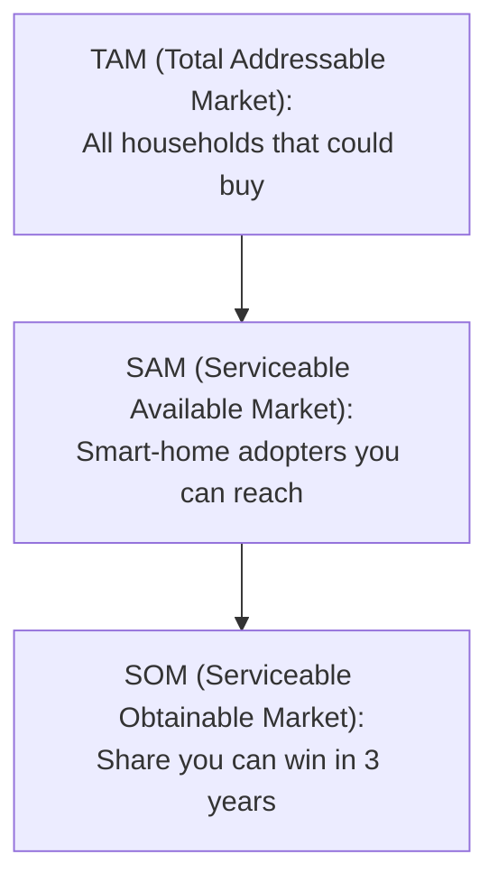

import ModuleNav from "/snippets/module-nav.mdx";

## Module Navigation

### All modules
- [Module 1: The Entrepreneurial Finance Ecosystem and Funding Landscape](/textbook/modules/module-01)
- [Module 2: Evaluating Venture Opportunities and Business Planning](/textbook/modules/module-02)
- [Module 3: Financial Projections and Startup Financials](/textbook/modules/module-03)
- [Module 4: Startup Valuation Methods and Cap Tables](/textbook/modules/module-04)
- [Module 5: Startup Valuation Methods](/textbook/modules/module-05)
- [Module 6: Term Sheet Mechanics](/textbook/modules/module-06)
- [Module 7: Cap Tables and Dilution](/textbook/modules/module-07)
- [Module 8: Investor–Founder Dynamics](/textbook/modules/module-08)
- [Module 9: Exit Strategies – IPOs, Acquisitions, and Secondaries](/textbook/modules/module-09)
- [Module 10: LP–GP Relationships and Venture Fund Structures](/textbook/modules/module-10)
- [Module 11: Global Venture Capital Markets and Cross-Border Investing](/textbook/modules/module-11)
- [Module 12: The Future of Venture Capital – Emerging Trends and Alternative Models](/textbook/modules/module-12)

### In this module
<TOC />

### Jump to next module
[Module 3: Financial Projections and Startup Financials](/textbook/modules/module-03)

## Module Snapshot

<Callout type="info" title="This module at a glance">
Focus on the core venture finance decisions tied to **Module 2**: opportunity selection, risk trade-offs, and investor-style reasoning.
</Callout>

## Key Facts

<CardGroup>
  <Card title="Module theme" icon="compass">
    Evaluating venture opportunities using investor-style filters and market sizing.
  </Card>
  <Card title="Key frameworks" icon="sitemap">
    Venture Evaluation Matrix, 4 M’s checklist, and Total Addressable Market (TAM)/Serviceable Available Market (SAM)/Serviceable Obtainable Market (SOM) sizing.
  </Card>
  <Card title="Core deliverable" icon="clipboard-check">
    Matrix scoring plus a lean pitch outline tied to the nine factors.
  </Card>
</CardGroup>

## Learning Objectives

<Callout type="success" title="Learning Objectives">
- Apply investor-style evaluation criteria to assess venture opportunities.
- Use the Venture Evaluation Matrix to identify strengths and deal-breaking weaknesses.
- Differentiate between traditional business plans and lean startup pitch approaches.
- Perform basic market sizing (TAM/SAM/SOM) and interpret why size matters for venture capital (VC) returns.
- Identify common red flags in pitches and how to avoid them.
- Translate evaluation insights into clearer, investor-ready narratives.
</Callout>

## Module Tasks

<Callout type="tip" title="Module Tasks">
- [ ] Complete a Venture Evaluation Matrix for a startup you know (real or hypothetical) with a 1–5 rating on each factor.
- [ ] Draft a 10-slide lean pitch outline that addresses the nine evaluation dimensions in the module.
</Callout>

## Key Concepts

- **Venture Evaluation Matrix:** A nine-factor framework for assessing opportunity strength across need, solution, team, market, competition, network, sales/marketing, production, and organization.
- **4 M’s:** Market, Model, Management, and Moat — a shorthand investor checklist.
- **TAM/SAM/SOM:** Total Addressable Market, Serviceable Available Market, and Serviceable Obtainable Market.
- **Lean startup:** Iterative method emphasizing build-measure-learn and rapid hypothesis testing.
- **Pitch deck:** Concise narrative of problem, solution, market, team, business model, traction, and ask.
- **Unit economics:** Revenue and cost per customer/unit to validate profitability at scale.
- **Minimum viable product (MVP):** The simplest testable version of a product used to validate demand.
- **Letter of intent (LOI):** A preliminary, non-binding commitment to buy or partner.
- **Cost of goods sold (COGS):** Direct costs required to deliver a product or service.
- **Customer acquisition cost (CAC):** Cost to acquire a paying customer.

## Main Content

### Chapter 1: Definitions and opportunity anatomy

Opportunity evaluation asks **who the customer is**, **what pain exists**, and **why this venture wins**.

- **Venture Evaluation Matrix:** Nine-factor scoring for opportunity strength.
- **4 M’s:** Market, Model, Management, Moat.
- **TAM/SAM/SOM:** Market size ladder for scale and focus.

<Callout type="info" title="Investor filter">
Investors scan for a large market and a team that can execute; everything else is secondary.
</Callout>

<CardGroup>
  <Card title="Need" icon="circle-question">
    Clear customer pain with urgency and willingness to pay.
  </Card>
  <Card title="Team" icon="users">
    Complementary skills, credibility, and coachability.
  </Card>
  <Card title="Market" icon="globe">
    Large, growing TAM with an accessible SAM.
  </Card>
</CardGroup>

### Chapter 2: Frameworks and decision tools

This chapter introduces the core evaluation tools, shows how to apply them in practice, and ends with guidance on interpreting results so that your conclusions are investor-ready.

#### Definitions: the evaluation toolkit

The **Venture Evaluation Matrix** is a nine-factor scoring framework that translates qualitative signals (problem clarity, team strength, traction) into a structured diagnostic. The **4 M’s** (Market, Model, Management, Moat) act as a quick investor screen that summarizes whether an opportunity is fundable at first glance. **TAM/SAM/SOM** sizing defines the total opportunity, the portion you can realistically serve, and the share you can reasonably obtain within a specific time frame.

In addition, entrepreneurs choose between a **lean pitch** and a **full business plan** depending on the venture’s execution risk, regulatory complexity, and capital intensity. A lean pitch prioritizes rapid learning and validated demand, while a full plan is warranted when operations, compliance, or infrastructure requirements are substantial.

#### Application: using the tools

Start with the Venture Evaluation Matrix as a quick diagnostic: score each factor, then flag the weakest two for immediate follow-up. The purpose is not to “average” the scores, but to identify where evidence is missing or where risks could derail the venture.

<Tabs>
  <Tab title="Venture Evaluation Matrix">
    | Factor | 1–5 Score | Evidence |
    | --- | --- | --- |
    | Need |  | Customer interviews, churn |
    | Solution |  | MVP test results |
    | Team |  | Relevant track record |
    | Market |  | TAM/SAM/SOM sizing |
    | Competition |  | Differentiation proof |
    | Traction |  | Pilots, LOIs, revenue |
    Close by writing one sentence on the evidence you still need to move each low score up one point.
  </Tab>
  <Tab title="Lean vs. full plan">
    - **Lean pitch:** Emphasizes fast learning, early traction, and a concise narrative that highlights validated demand.
    - **Full plan:** Provides operational depth for regulated markets, complex supply chains, or capital-heavy models.
  </Tab>
</Tabs>

#### Interpretation: what the results mean

Treat each score as a hypothesis about risk, not a definitive verdict. A low score identifies the next best experiment or data point, while a high score should still be supported by evidence that is repeatable and defensible. When you interpret the matrix, explain how the score translates into a decision: continue, pause for validation, or redesign the approach.

### How investors actually score

Investors score quickly, then ask for **evidence that lifts the weakest scores**. A “3” moves to a “4” only when there is proof of repeatability or a defensible advantage, so the interpretation must be grounded in data rather than optimism.

| Matrix factor | Evidence examples investors look for | Common red flags |
| --- | --- | --- |
| **Need** | Interview quotes with quantified pain, waitlist growth, churn from current solutions | Problem is “nice-to-have,” users are indifferent, no willingness to pay |
| **Solution** | MVP adoption metrics, time-to-value data, pilot results with outcomes | Product demos well but usage drops, feature soup, unclear differentiation |
| **Team** | Relevant domain execution, founder–market fit, complementary skills, advisor depth | Solo founder with gaps, high turnover, lack of sales/ops leadership |
| **Market** | Bottom-up TAM/SAM/SOM, growing segment trends, proof of reachable buyers | Top-down only, SAM tiny, market shrinking or overly regulated |
| **Competition** | Win/loss data, differentiated positioning, moat evidence (IP, data, distribution) | “No competitors,” switching costs ignored, incumbents can copy quickly |
| **Traction** | Revenue growth, retention/cohort curves, LOIs with paid pilots, partnerships | Vanity metrics, flat retention, pilots with no conversion path |
| **Network** | Strategic partners, distribution channels, ecosystem pull, referrals | Over-reliance on one partner, no channel strategy, weak inbound |
| **Sales/Marketing** | CAC/LTV ratios, repeatable channel tests, clear ICP and sales cycle | CAC assumptions untested, long sales cycle without capital plan |
| **Production/Operations** | Manufacturing plan, supply chain reliability, QA benchmarks, unit cost roadmap | Undefined cost structure, single-source risk, regulatory unknowns |
| **Organization** | Clear roles, hiring plan tied to milestones, governance readiness | Org chart vs. reality mismatch, unclear accountability, no operational cadence |

<Callout type="tip" title="Scoring reality check">
If a factor cannot be validated with at least two concrete data points, assume a “2” or “3” and ask for the missing evidence.
</Callout>

### Chapter 3: Investor vs. founder perspective

| Dimension | Founder lens | Investor lens | Implication |
| --- | --- | --- | --- |
| Market sizing | “Big enough” | Must return a fund | TAM discipline |
| Team | Passion and mission | Execution and adaptability | Team gaps matter |
| Traction | Early signals | Evidence of repeatability | Metrics > vision |
| Plan depth | Detailed story | Proof of assumptions | Experiments win |

### Chapter 4: Worked example with numbers

**Scenario:** Smart-home air sensor startup targeting North America.

| Step | Calculation | Result |
| --- | --- | --- |
| TAM | 50M households × \$150 device | \$7.5B |
| SAM | 20% smart-home adopters | \$1.5B |
| SOM (3 yrs) | 3% of SAM | \$45M |

**TAM/SAM/SOM example with assumptions**

If you’re building a campus delivery app, define **TAM (Total Addressable Market)** as all university students who could order delivery, **SAM (Serviceable Available Market)** as students within campuses you can operate in, and **SOM (Serviceable Obtainable Market)** as the share you can realistically capture in the first 24–36 months.

**Assumption checklist**
- [ ] Count of universities included and average enrollment per campus.
- [ ] Percentage of students who order delivery at least monthly.
- [ ] Average order value and frequency per student.
- [ ] Initial market share target by end of Year 3.
- [ ] Constraints (delivery radius, hours, local regulations).

**Unit economics snapshot**

| Metric | Value |
| --- | --- |
| Price | \$150 |
| COGS | \$60 |
| Gross margin | \$90 (60%) |
| CAC | \$40 |
| Payback | &lt;2 months |

Use the snapshot to explain whether the business scales profitably and what levers improve payback time.

### Step-by-step TAM/SAM/SOM walkthrough

**Sample industry:** Remote patient monitoring (RPM) for mid-sized hospitals.

1. **Define TAM (all potential buyers).**  
   *Example:* 1,800 mid-sized hospitals in the U.S. × 1,200 monitored patients per hospital × \$40/month.  
   **TAM:** 1,800 × 1,200 × \$40 × 12 = **\$1.04B/year**.
2. **Define SAM (serviceable buyers you can reach).**  
   *Example:* Focus on 8 states with supportive reimbursement policies (35% of hospitals).  
   **SAM:** \$1.04B × 35% = **\$364M/year**.
3. **Define SOM (share you can win in 3 years).**  
   *Example:* Target 6% share via five-channel partnerships and a 9-month sales cycle.  
   **SOM:** \$364M × 6% = **\$21.8M/year**.
4. **Tie to capacity.**  
   *Example:* 25 sales reps × 4 hospitals closed/year × \$180k ARR each = **\$18M ARR**, which aligns with the SOM target.

**Sensitivity note:** If reimbursement changes or the sales cycle stretches from 9 to 15 months, SOM can drop by 30–40%. Always show the two most sensitive assumptions and their impact on SOM.

### Mini-exercise: Red flag detector

Spot the red flags, then write one follow-up question you would ask the founder.

- **Market mismatch:** TAM looks big, but the SAM is tiny or undefined.  
  *Prompt:* “Which specific segment are you targeting first, and why?”
- **Team gap:** No one owns sales/operations for a go-to-market-heavy business.  
  *Prompt:* “Who will lead distribution or partnerships in the next six months?”
- **Unit economics fog:** CAC and margin assumptions are missing or implausible.  
  *Prompt:* “What data supports your CAC and gross margin estimates?”
- **Traction ambiguity:** Vanity metrics replace customer retention or revenue.  
  *Prompt:* “What’s your 30/90-day retention and how does it trend?”

### Chapter 5: Summary checklist

<Steps>
  <Step title="Size the market">
    Build a TAM/SAM/SOM ladder with defensible assumptions.
  </Step>
  <Step title="Score the matrix">
    Identify the two weakest factors and design fixes.
  </Step>
  <Step title="Translate to a pitch">
    Summarize need, solution, traction, and ask in 10 slides or fewer.
  </Step>
</Steps>

## Key Takeaways

<Callout type="success" title="Key Takeaways">
- Investors prioritize market size and team execution before story polish.
- The evaluation matrix highlights weak assumptions early.
- Market sizing anchors valuation expectations and return potential.
</Callout>

## Worked Examples

### In-class activity: Pitch deck critique workshop

- **Setup:** Students analyze two sample pitch decks (tech and non-tech) in small groups.
- **Materials:** Pitch decks and an evaluation checklist (team, market, product, model, traction).
- **Review:** Groups spend ~10 minutes extracting key points from each slide.
- **Apply investor lens:** Note strengths and red flags; document evidence for each criterion.
- **Prepare feedback:** Decide whether to pursue a follow-up and draft 2–3 reasons plus a question for founders.
- **Presentation:** Groups share conclusions; instructor tallies positives/negatives on the board.
- **Expected outputs:** A shared list of pitch do’s/don’ts and sector-specific evaluation differences.

### Case study: InNovaTech or In-No-Vation?

#### Case background

- Andrea Silva developed an air-quality sensor for home use and is preparing to pitch angels.
- She has a working prototype and pilot results; the market is growing, but competition exists.

#### Investor evaluation (Julian’s perspective)

- **Need:** Clear health-driven demand, though awareness is still building.
- **Market size:** TAM could be large, but the near-term SAM is likely smaller.
- **Competition:** Startups and incumbents (e.g., Google/Nest) pose significant threat.
- **Team:** Solo founder with strong technical skills but missing business/manufacturing coverage.
- **Business model:** Hardware margins ~\$50/unit with an undeveloped subscription idea.
- **Financials:** Projections show 1,000 → 10,000 → 50,000 units in three years; growth and marketing spend look optimistic.
- **Overall:** Promising product but weak go-to-market and team execution risk.

### Detailed pitch evaluation example: FlowGrid (warehouse automation)

**Need (Score: 4/5).** FlowGrid shows credible pain: warehouse managers lose ~8 hours/week to manual slotting changes, validated by 22 interviews and two paid pilots. The pitch quantifies labor cost savings and missed SLA penalties. The score stops at 4 because customer urgency spikes only during seasonal peaks, and multi-year contracts are untested.

**Solution (Score: 3/5).** The product demo shows real-time slotting suggestions and 12% pick-speed gains in pilots. However, integration with legacy warehouse management systems is still custom and adds friction. Investors score a cautious 3 until the team proves faster onboarding and repeatable deployment.

**Team (Score: 4/5).** The CEO previously led ops at a 3PL, and the CTO shipped similar optimization tools at a logistics software firm. There is still a gap in enterprise sales leadership, so investors expect a VP Sales hire within 90 days to earn a 5.

**Market (Score: 3/5).** The team’s TAM includes all warehouses, but the credible SAM is only mid-sized facilities with modern scanners. Bottom-up math suggests a \$450M SAM and a realistic \$25M SOM in three years. The market is real but not massive, so a 3 reflects size constraints.

**Competition (Score: 3/5).** Incumbent WMS vendors offer basic slotting, and new startups are emerging. FlowGrid’s advantage is faster optimization and a data model tuned for mixed SKU warehouses, but switching costs are modest. Investors need clearer defensibility (data network effects or exclusive partnerships).

**Traction (Score: 4/5).** Two pilots converted to annual contracts and show 92% operator adoption after 60 days. Revenue is still small (\$240k ARR), yet retention is strong and expansion pipeline is clear. A 4 signals momentum with proof of repeatability still needed.

**Network (Score: 2/5).** The team relies on inbound referrals from a single logistics consultant. No formal channel partnerships exist, and OEM relationships are exploratory. Investors score a 2 until the pipeline shows diverse sources.

**Sales/Marketing (Score: 3/5).** Sales cycles average 7–9 months with \$38k CAC and \$120k LTV in pilots, which is promising. But the paid acquisition channels are untested, and the founder-led sales model may not scale. A 3 reflects early validation without full repeatability.

**Production/Operations (Score: 4/5).** The software is cloud-based with strong uptime and a clear roadmap for onboarding automation. The main risk is customization load and support staffing as deployments scale. Investors award a 4 given operational maturity but watch support costs.

**Organization (Score: 3/5).** Roles and OKRs are documented, and the company runs monthly KPI reviews. Hiring plans are aggressive without clear budget for HR/ops. Investors see governance fundamentals but want tighter org planning before Series A.

### Mini-workshop: Turn a weak pitch into a strong pitch

**Weak pitch signals**
- “Huge market” with no TAM/SAM/SOM math.
- Product demo only, no customer proof.
- Generic team bios with no execution story.
- No mention of CAC, LTV, or payback.

**Stronger pitch upgrades**
- Quantified TAM/SAM/SOM with two sensitivity scenarios.
- 2–3 customer quotes and retention metrics.
- Team evidence tied to past wins or domain expertise.
- Unit economics snapshot with CAC/LTV and payback.

## Additional Practice Questions

<AccordionGroup>
  <Accordion title="1. What two data points would you use to move a ‘Need’ score from 2 to 4?">
    Interview quotes quantifying pain and evidence of willingness to pay (e.g., paid pilot conversion or pre-orders).
  </Accordion>
  <Accordion title="2. Why is a ‘no competitors’ slide a red flag?">
    It usually signals shallow market understanding or underestimates substitution; real markets have alternatives and incumbents.
  </Accordion>
  <Accordion title="3. A startup shows 100k app downloads but 2% weekly retention. How should traction be scored and why?">
    Low retention suggests weak product–market fit, so traction scores low despite top-of-funnel volume.
  </Accordion>
  <Accordion title="4. Which assumption most impacts SOM in a new enterprise SaaS pitch: sales cycle length or design aesthetics?">
    Sales cycle length, because it directly affects capacity and reachable revenue in the first 2–3 years.
  </Accordion>
  <Accordion title="5. What evidence would justify a 5/5 on Team?">
    Proven execution in the same market, complementary functional coverage, and a track record of shipping and scaling.
  </Accordion>
  <Accordion title="6. List one sign of weak organization readiness.">
    No ownership of key functions (e.g., no GTM lead) or missing operating cadence/metrics.
  </Accordion>
  <Accordion title="7. How does a bottom-up market size estimate improve investor confidence?">
    It shows realistic buyer counts, pricing, and adoption assumptions instead of inflated top-down numbers.
  </Accordion>
  <Accordion title="8. What is one red flag in a production/operations plan?">
    Single-source suppliers or undefined cost structure for scaling.
  </Accordion>
</AccordionGroup>

## Short Quiz

<AccordionGroup>
  <Accordion title="Quiz 1: If the SAM is $500M and realistic 3-year share is 4%, what is SOM?">
    \$20M (0.04 × \$500M).
  </Accordion>
  <Accordion title="Quiz 2: Name one metric that signals strong traction beyond vanity metrics.">
    Cohort retention, revenue growth, expansion, or paid conversion from pilots.
  </Accordion>
  <Accordion title="Quiz 3: What is the primary reason investors care about CAC payback?">
    It shows whether the business can scale efficiently without excessive capital burn.
  </Accordion>
</AccordionGroup>

#### Exhibits

- **Exhibit 1 — Financial projections (U.S. dollars (USD)):**
  - Year 1: 1,000 units, \$100k revenue, ~\$80k net loss.
  - Year 2: 10,000 units, \$1M revenue, ~\$100k profit.
  - Year 3: 50,000 units, \$5M revenue, ~\$1M profit, assumes retail distribution.
  - Note: \$250k seed may not cover cash needs beyond Year 2 without a larger round.
- **Exhibit 2 — Opportunity evaluation matrix:**
  - Need 8/10, Solution 8/10, Team 4/10, Market 6/10, Competition 5/10, Business Model 5/10, Traction 3/10.
  - Summary: Strong tech with uncertain execution and market validation.

### Case synthesis: GreenRidge & InNovaTech

- GreenRidge: strong team/traction, limited market scale.
- InNovaTech: large potential market and novel tech, weak team and low traction.
- Key insight: execution risk can be fixed; a tiny market cannot without pivoting.
- Five investor questions to internalize: opportunity size, team fit, evidence of demand, business model economics, and milestone-driven use of funds.

### Discussion prompts and teaching notes

- **Would you fund InNovaTech? Why or why not?**
  - Teaching note: Balance product promise with team risk, competitive pressure, and limited traction; many conclude it is too early for VC.
- **What additional information or validation would you require?**
  - Teaching note: Customer validation, prototype testing, intellectual property (IP) clarity, go-to-market evidence, and team additions.
- **Evaluate the realism of InNovaTech’s projections. What changes would you make?**
  - Teaching note: Flag aggressive 50x growth, missing marketing spend, and need for follow-on funding; suggest more conservative ramp.
- **How do low team and traction scores affect investability?**
  - Teaching note: Solo founder and pre-revenue status increase execution risk; recommend co-founder/advisors and early validation.
- **What advice should Andrea follow before her angel pitch?**
  - Teaching note: Address team gaps, clarify go-to-market, share customer evidence, and acknowledge competitive risks.

## Pitfalls

<Callout type="warning" title="Pitfalls to Avoid">
- Treating a tiny market as VC-scale or ignoring TAM/SAM/SOM realism.
- Over-relying on a long business plan without traction or customer evidence.
- Assuming “no competition” is a strength instead of a red flag.
- Presenting hockey-stick projections without a credible go-to-market plan.
- Pitching with a team missing critical skills or no plan to fill gaps.
- Ignoring unit economics and the path to profitability.
</Callout>

## Quick Checks

<Tabs>
  <Tab title="TAM/SAM/SOM sizing">
    Draft a quick market sizing ladder for the InNovaTech case (TAM = global air-quality market, SAM = smart home segment, SOM = first 3 target regions).
  </Tab>
  <Tab title="Investor filter">
    Circle the two highest-weight criteria you would score first (team, market, traction, business model).
  </Tab>
</Tabs>

<AccordionGroup>
  <Accordion title="Venture Evaluation Matrix focus">
    **Question:** Which two matrix factors most often kill a deal?  
    **Answer:** Weak team execution and a market too small to return a fund.
  </Accordion>
  <Accordion title="Lean vs. full plan">
    **Question:** When is a detailed business plan still valuable?  
    **Answer:** When operations are complex (regulated, capital-intensive) and investors need execution detail.
  </Accordion>
  <Accordion title="Red flag check">
    **Question:** What is one red flag hidden in “no competitors”?  
    **Answer:** It often means weak demand or a poorly defined market.
  </Accordion>
</AccordionGroup>

- **What key factors do investors examine when evaluating a startup opportunity?** Market, model, management, and moat (or a similar multi-factor checklist including team, product, traction, and financials).
- **How do investors size a market, and why does it matter?** TAM/SAM/SOM define the total and near-term opportunity; VC returns require large market scale.
- **What makes a founding team attractive to investors?** Credible, coachable, balanced, and evidence of execution ability.
- **Why are pitch decks and traction often favored over long business plans?** Investors prefer concise clarity and evidence that assumptions are validated in the market.
- **How can lean startup complement or conflict with traditional planning?** Lean validates assumptions quickly; plans provide strategy but must evolve with evidence.
- **What red flags cause investors to reject pitches?** Unrealistic projections, weak teams, denial of competition, unclear business models, and ignoring risks.

## Readings

### Required Readings

- **Sahlman, W. (1997). “How to Write a Great Business Plan.” Harvard Business Review.** Four key factors: People, Opportunity, Context, and Risk/Reward.
- **Frankel, D. (2021). “Four Ways that VCs Evaluate Startup Pitches.”** Investor view on fundamentals, storytelling, deal terms, and fit.

### Optional Readings

- **Ries, E. (2011). The Lean Startup (Chapter 2).** Validated learning through hypotheses and MVP tests.
- **Kawasaki, G. (2004). “The Art of the Start” (10/20/30 Rule).** Simple structure for effective pitches.

## Summary

- Venture evaluation is multi-dimensional; a single weak factor can derail investment.
- Large, growing markets and strong teams are the most consistent investor priorities.
- Use TAM/SAM/SOM to define scale; pair narrative with traction to reduce uncertainty.
- A hybrid approach combines lean experimentation with strategic planning.

## Practice Questions

**Question:** Which two matrix factors most often kill a deal?  

Show answer

**Answer:** Weak team execution and a market too small to return a fund.

**Question:** Why can a large TAM still be a weak investment case?  

Show answer

**Answer:** If SAM/SOM are tiny or inaccessible due to distribution constraints.

**Question:** When is a full business plan still necessary?  

Show answer

**Answer:** Regulated, capital-intensive, or complex operational models.

**Question:** Name one traction metric more persuasive than a forecast.  

Show answer

**Answer:** Paid pilots, retention data, or signed LOIs.

**Question:** What founder action most directly improves a low team score?  

Show answer

**Answer:** Add a co-founder/advisor with missing domain or go-to-market skill.

**Question:** If SOM is \$45M and target share is 10%, what revenue is implied?  

Show answer

**Answer:** \$4.5M.

<ModuleNav previous="/textbook/modules/module-01" previousLabel="Module 1: The Entrepreneurial Finance Ecosystem and Funding Landscape" next="/textbook/modules/module-03" nextLabel="Module 3: Financial Projections and Startup Financials" />
