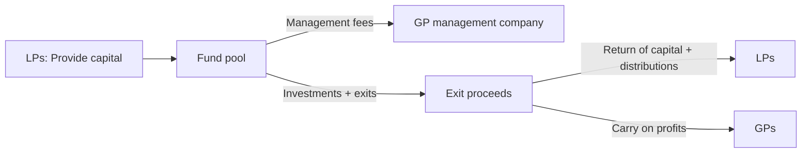

import ModuleNav from "/snippets/module-nav.mdx";

## Module Navigation

### All modules
- [Module 1: The Entrepreneurial Finance Ecosystem and Funding Landscape](/textbook/modules/module-01)
- [Module 2: Evaluating Venture Opportunities and Business Planning](/textbook/modules/module-02)
- [Module 3: Financial Projections and Startup Financials](/textbook/modules/module-03)
- [Module 4: Startup Valuation Methods and Cap Tables](/textbook/modules/module-04)
- [Module 5: Startup Valuation Methods](/textbook/modules/module-05)
- [Module 6: Term Sheet Mechanics](/textbook/modules/module-06)
- [Module 7: Cap Tables and Dilution](/textbook/modules/module-07)
- [Module 8: Investor–Founder Dynamics](/textbook/modules/module-08)
- [Module 9: Exit Strategies – IPOs, Acquisitions, and Secondaries](/textbook/modules/module-09)
- [Module 10: LP–GP Relationships and Venture Fund Structures](/textbook/modules/module-10)
- [Module 11: Global Venture Capital Markets and Cross-Border Investing](/textbook/modules/module-11)
- [Module 12: The Future of Venture Capital – Emerging Trends and Alternative Models](/textbook/modules/module-12)

### In this module
<TOC />

### Jump to next module
[Module 11: Global Venture Capital Markets and Cross-Border Investing](/textbook/modules/module-11)

## Module Snapshot

<Callout type="info" title="This module at a glance">
Focus on the core venture finance decisions tied to **Module 10**: opportunity selection, risk trade-offs, and investor-style reasoning.
</Callout>

## Key Facts

<CardGroup>
  <Card title="Module theme" icon="compass">
    Limited partner (LP) investors supply capital, while general partners (GPs) manage investments, fund economics, and incentive alignment.
  </Card>
  <Card title="Key frameworks" icon="sitemap">
    Fee/carry math, fund life cycles, and governance protections.
  </Card>
  <Card title="Core deliverable" icon="clipboard-check">
    Fund incentive brief plus LP due-diligence questions.
  </Card>
</CardGroup>

## Learning Objectives

<Callout type="success" title="Learning Objectives">
- Explain the limited partner (LP)–general partner (GP) relationship and core fund economics.
- Identify governance mechanisms that protect LP interests.
- Evaluate how market cycles affect fundraising and LP confidence.
- Recognize emerging fund structures and their implications.
</Callout>

## Module Tasks

<Callout type="tip" title="Module Tasks">
- [ ] Map a venture capital (VC) fund’s incentive structure (fees, carry, GP commit, hurdles) in a one-page brief.
- [ ] Draft three questions you would ask a GP as an LP during due diligence.
</Callout>

## Key Concepts

To ensure consistent terminology, this module uses LP (limited partner), GP (general partner), LPAC (limited partner advisory committee), DPI (distributions to paid-in), TVPI (total value to paid-in), and IRR (internal rate of return).

### Definitions
- **Limited partnership:** LPs provide capital; GPs manage investments.
- **Limited partner (LP):** Supplies capital and seeks returns.
- **General partner (GP):** Manages the fund and makes investments.
- **Limited Partner Advisory Committee (LPAC):** Advisory committee that oversees conflicts and fund extensions.

### Mechanics
- **2 and 20:** ~2% management fee and 20% carry.
- **GP commitment:** GP invests 1–2% to align incentives.
- **Hurdle rate:** Preferred return before carry is paid.

### Implications and measurement
- **DPI, TVPI, and IRR:** Core LP performance metrics capturing liquidity, total value, and time-weighted returns.

## Main Content

### Definitions: LP–GP roles and fund structure basics

Venture funds connect **LP capital** with **GP decision-making**.

- **LPs:** Provide capital and expect returns.
- **GPs:** Manage the fund and make investments.
- **Management fee:** Annual fee (e.g., 2%) to run the fund.
- **Carry:** Share of profits (e.g., 20%).

<Callout type="info" title="Fund math drives behavior">
GP incentives are shaped by fee income, carry, and fund life.
</Callout>

<CardGroup>
  <Card title="Incentives" icon="bullseye">
    Fee and carry align GP behavior with performance.
  </Card>
  <Card title="Fund economics" icon="calculator">
    Fee load reduces investable capital.
  </Card>
  <Card title="Portfolio strategy" icon="sitemap">
    Fund size dictates check size and ownership targets.
  </Card>
</CardGroup>

### Mechanics: Fund life cycle, economics stack, and cash flows

<Tabs>
  <Tab title="Fund life cycle">
    - Years 0–3: Invest
    - Years 4–7: Support and follow-on
    - Years 8–10: Exit and distribute
  </Tab>
  <Tab title="Economics stack">
    - Management fees cover ops
    - Carry rewards top performance
    - Clawbacks protect LPs
  </Tab>
</Tabs>

#### Fund cash flows across a 10-year life

Funds follow a predictable cash flow arc: **fees and capital calls early, deployment mid-cycle, and distributions late**. The table summarizes how the sequence affects LP liquidity and performance evaluation.

| Year range | Net cash flow pattern | What’s happening | LP implication |
| --- | --- | --- | --- |
| 0–2 | Outflows dominate | Management fees begin; capital calls for initial investments | Expect negative cash flow (J-curve starts). |
| 3–5 | Peak outflows | Follow-ons, reserves, and ongoing fees | Most committed capital is called. |
| 6–8 | Mixed flows | First exits and partial distributions | DPI starts to climb; TVPI stabilizes. |
| 9–10+ | Inflows dominate | Realizations and tail-end exits | DPI catches up to TVPI; liquidity event window. |

**Interpretation:** The sequence reinforces why LPs monitor DPI early for liquidity signals and TVPI later for total value validation.

**Cash flow drivers by category**
- **Fees:** Paid annually from committed capital (often step down after the investment period).
- **Deployment:** Capital calls fund new investments and follow-ons; pacing depends on strategy and market cycle.
- **Distributions:** Cash or stock from exits; early distributions improve DPI and reduce perceived risk.

### Mechanics: Performance metrics (DPI, TVPI, IRR)

Use these metrics together to see **liquidity timing** and **total value**. Each metric emphasizes a different dimension of LP outcomes.

- **DPI (Distributions to Paid-In):** Cash returned ÷ capital called.  
  **Example:** \$30M distributed on \$60M paid-in = **0.5× DPI**.  
  **Interpretation:** Below 1.0× means LPs have not received back their capital yet.
- **TVPI (Total Value to Paid-In):** (Distributions + remaining NAV) ÷ paid-in.  
  **Example:** \$30M distributed + \$45M NAV = \$75M on \$60M paid-in = **1.25× TVPI**.  
  **Interpretation:** Captures total value, but can be inflated by unrealized marks.
- **IRR (Internal Rate of Return):** Time-weighted annualized return based on cash flow timing.  
  **Example:** \$60M called over years 1–3 and \$120M distributed in year 8 yields **~10–12% IRR** (timing sensitive).  
  **Interpretation:** High IRR can come from early small exits; compare alongside DPI/TVPI to avoid timing bias.

**Interpretation:** DPI indicates liquidity, TVPI reflects overall value, and IRR explains time-weighting; LPs rely on the trio to avoid misleading signals from any single metric.

### Implications: Investor vs. founder perspective

Use this lens table to compare priorities by stakeholder so you can see where incentives align or diverge. The contrast clarifies how LP objectives shape GP decisions and founder expectations.

| Dimension | Founder lens | GP lens | LP lens |
| --- | --- | --- | --- |
| Objectives | Capital and support | Portfolio returns | Risk-adjusted returns |
| Time horizon | Company life | Fund life | Long-term allocation |
| Reporting | Updates | Portfolio management | Fund performance |
| Risk | Single-company focus | Diversified bets | Portfolio allocation |

**Takeaway:** LPs care most about fund-level risk-adjusted outcomes, while GPs balance portfolio construction and founders focus on company survival.

### Implications: Worked example with numbers

**Scenario:** \$100M fund, 2% fee, 20% carry, 10-year life.

The table below shows how fees reduce investable capital and how carry is calculated after profits. It clarifies why LPs track fee drag and profit sharing when evaluating net returns.

| Item | Calculation | Result |
| --- | --- | --- |
| Total fees | 2% × \$100M × 10 yrs | \$20M |
| Capital for investments | \$100M - \$20M | \$80M |
| Gross fund return | 3× | \$300M |
| Carry to GPs | 20% of profits (\$200M) | \$40M |

**Takeaway:** Fees shrink capital available for deals, while carry compounds GP upside only after LPs are repaid.

### Implications: LP due diligence questions (checklist)

Use this checklist when reviewing a GP pitch deck to translate definitions and mechanics into concrete LP decision criteria.

1. What is the target DPI/TVPI/IRR, and how does it compare to prior funds?
2. How much GP commitment is there, and who is providing it?
3. What is the fee schedule (including step-downs after the investment period)?
4. What is the carry structure, hurdle rate, and clawback mechanics?
5. How concentrated is the portfolio strategy by stage, sector, and geography?
6. How are reserves for follow-on investments determined?
7. What is the expected capital call pacing and deployment period?
8. What are the fund extension terms and LPAC approval thresholds?
9. What key person provisions or team succession plans exist?
10. How does the GP source and win deals versus competitors?
11. What are the valuation and marking policies for unrealized assets?
12. Are there co-investment rights or side-letter terms offered?
13. What ESG, compliance, or conflict management policies are in place?
14. What transparency and reporting cadence should LPs expect?

### Implications: Negotiation case — Horizon Seed Fund III

**Scenario:** Horizon Seed Fund III targets \$180M. The GP wants 2.25% fees for years 1–5, 20% carry, and a 2-year fund extension option. A lead LP offers \$40M but asks for 2.0% fees, a 6% hurdle, and stronger key person terms.

**Key terms and trade-offs**
- **Fees vs. operating capacity:** Lower fees reduce LP cost but may limit platform resources.
- **Hurdle rate:** LPs want a preferred return; GPs argue seed outcomes are volatile.
- **Key person trigger:** LPs seek protection if a partner leaves; GPs want flexibility.
- **Extension rights:** LPs want tighter LPAC control; GPs want time to realize exits.
- **Co-investment rights:** LPs want access to top deals; GPs worry about allocation complexity.

**Decision prompt:** Propose a compromise package that keeps the fund viable while strengthening LP protections.

### Chapter 5: Summary checklist

<Steps>
  <Step title="Understand incentives">
    Fund structures create time and return pressure on GPs.
  </Step>
  <Step title="Match strategy">
    Fund size dictates target ownership and check size.
  </Step>
  <Step title="Align reporting">
    LPs expect consistent performance reporting and risk controls.
  </Step>
</Steps>

## Key Takeaways

<Callout type="success" title="Key Takeaways">
- Fund economics determine GP incentives and behavior.
- Governance tools like LPACs protect LP interests.
- Market cycles shift fundraising leverage and term flexibility.
</Callout>

## Worked Examples

### In-class activity: Fund terms negotiation

- **Role-play:** GPs raising a new fund negotiate with LPs on fees, carry, and terms.
- **Topics:** GP commitment, hurdle rates, co-invest rights, fund size, and term length.
- **Outcome:** Compare negotiated terms and discuss incentives and governance impacts.

### Case study: Evergreen Ventures in turbulent times

- **Fund I:** \$150M, year 8, TVPI 1.4×, DPI 0.2×; limited exits.
- **Fund II:** \$200M, early in investment period.
- **Dilemma:** Extend Fund I or pursue GP-led secondary for a fintech unicorn.
- **Fund III:** LPs hesitant; corporate LP wants co-invest rights and advisory seat.
- **Decision points:** LP trust, fee concessions, and fairness to existing LPs.

### Discussion prompts and teaching notes

- **Extend Fund I or pursue a secondary?**
  - Teaching note: Balance liquidity needs vs. upside potential and LP trust.
- **How should Evergreen communicate with LPs?**
  - Teaching note: Proactive transparency and LPAC engagement matter.
- **Should Evergreen grant corporate LP terms?**
  - Teaching note: Consider fairness, conflicts, and precedent.
- **How can GPs rebuild trust with low DPI?**
  - Teaching note: Fee concessions, GP participation, and realistic timelines.

## Pitfalls

<Callout type="warning" title="Pitfalls to Avoid">
- Over-relying on management fees instead of carry alignment.
- Under-communicating during exit delays or valuation markdowns.
- Granting special LP terms that create conflicts or perceived unfairness.
- Ignoring LP pressure for DPI during long exit cycles.
</Callout>

## Quick Checks

<Tabs>
  <Tab title="LP lens">
    Identify the three metrics you would check first when evaluating a new fund (DPI, TVPI, IRR).
  </Tab>
  <Tab title="GP lens">
    Identify two terms you would propose to prove alignment (higher GP commit, hurdle rate).
  </Tab>
</Tabs>

<AccordionGroup>
  <Accordion title="2 and 20 refresher">
    **Question:** What does “2 and 20” mean in VC fund economics?  
    **Answer:** ~2% annual management fee and 20% carry on profits.
  </Accordion>
  <Accordion title="LPAC role">
    **Question:** What does an LPAC typically approve?  
    **Answer:** Conflicts, extensions, and major fund changes.
  </Accordion>
  <Accordion title="Fund life">
    **Question:** Why is fund life (10+ years) critical for LP planning?  
    **Answer:** It determines liquidity timing and capital call pacing.
  </Accordion>
</AccordionGroup>

- **How do fund economics align incentives?** Carry rewards upside after LP capital return.
- **How do LPs evaluate GPs?** Track record, strategy, and transparency.
- **What protects LP interests?** Limited partnership agreement (LPA) clauses, LPAC oversight, GP commitment.
- **How do market cycles affect LP–GP dynamics?** Downturns reduce commitments and increase scrutiny.
- **What fund innovations are emerging?** Rolling funds, continuation funds, and solo GPs.

## Readings

### Required Readings

- **Affinity (2023).** LP–GP roles, fees, carry, and alignment basics.
- **Fish (2025).** Top LP due-diligence questions and DPI focus.

### Optional Readings

- **Kauffman Fellows (2012).** Critique of misaligned VC incentives and underperformance.
- **VenCap (2025).** Power law, fundraising contraction, and LP consolidation trends.

## Summary

- LP–GP partnerships rely on alignment, transparency, and governance.
- Fund economics (fees, carry, hurdles) shape GP behavior.
- Market cycles shift LP leverage and fundraising dynamics.

## Practice Questions

<AccordionGroup>
  <Accordion title="What is 2% management fee on a $50M fund per year?">
    **Answer:** \$1M per year.
  </Accordion>
  <Accordion title="If a fund returns $200M on a $100M fund, what profit is subject to carry?">
    **Answer:** \$100M profit.
  </Accordion>
  <Accordion title="Why do GPs prefer exits before year 10?">
    **Answer:** To return capital and show performance within fund life.
  </Accordion>
  <Accordion title="What do LPs want besides high returns?">
    **Answer:** Consistent reporting, risk management, and diversification.
  </Accordion>
  <Accordion title="How does a larger fund affect deal size?">
    **Answer:** It pushes larger checks and ownership targets.
  </Accordion>
  <Accordion title="What is a clawback?">
    **Answer:** A mechanism to return excess carry to LPs if later losses occur.
  </Accordion>
  <Accordion title="If DPI is 0.4× and TVPI is 1.3×, what does that imply?">
    **Answer:** Most value is still unrealized; liquidity is limited despite marked value.
  </Accordion>
  <Accordion title="Why might a fund show high IRR but modest TVPI?">
    **Answer:** Early exits boost time-weighted returns, but total value creation may be limited.
  </Accordion>
</AccordionGroup>

## Applied Exercises

<AccordionGroup>
  <Accordion title="Exercise 1: Calculate fund metrics">
    **Prompt:** A fund calls \$80M over years 1–4, has distributed \$40M, and has \$70M in NAV. Calculate DPI and TVPI.  
    **Answer:** DPI = \$40M ÷ \$80M = **0.50×**. TVPI = (\$40M + \$70M) ÷ \$80M = **1.375×**.
  </Accordion>
  <Accordion title="Exercise 2: Negotiate terms">
    **Prompt:** An LP offers a \$25M anchor commitment if fees step down from 2% to 1.5% after year 5 and the GP commit rises to 2%. Suggest one GP-friendly concession that preserves alignment.  
    **Answer:** Offer a modest carry increase on returns above a higher hurdle (e.g., 22% carry above 2.0×) or a defined extension option with LPAC approval.
  </Accordion>
</AccordionGroup>

<ModuleNav previous="/textbook/modules/module-09" previousLabel="Module 9: Exit Strategies – IPOs, Acquisitions, and Secondaries" next="/textbook/modules/module-11" nextLabel="Module 11: Global Venture Capital Markets and Cross-Border Investing" />
